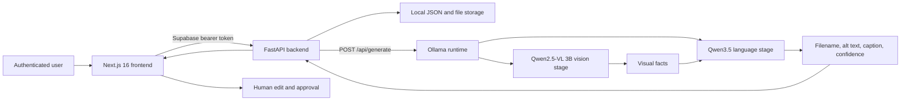
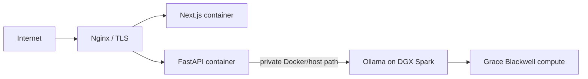
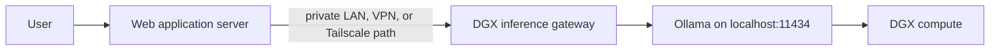
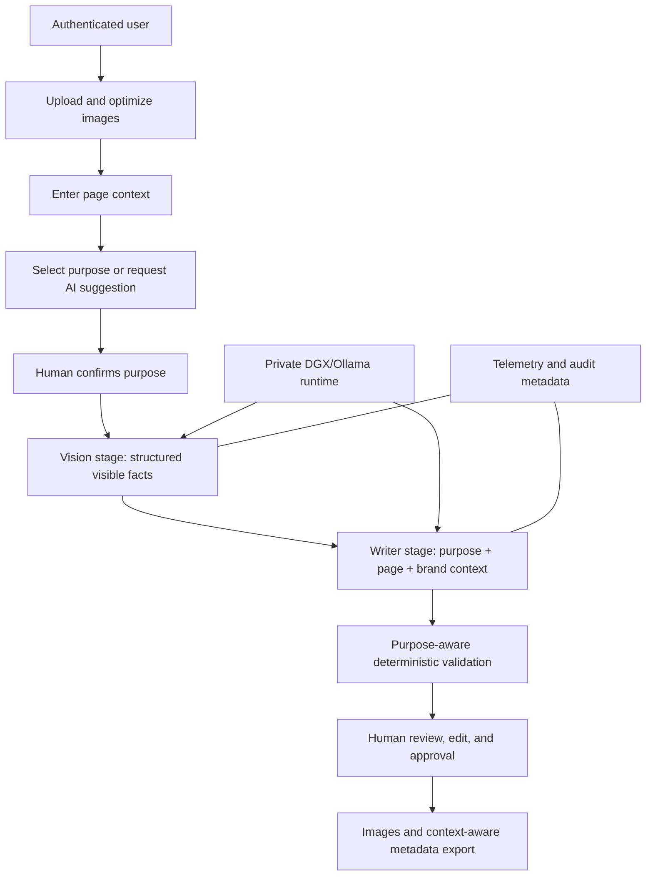
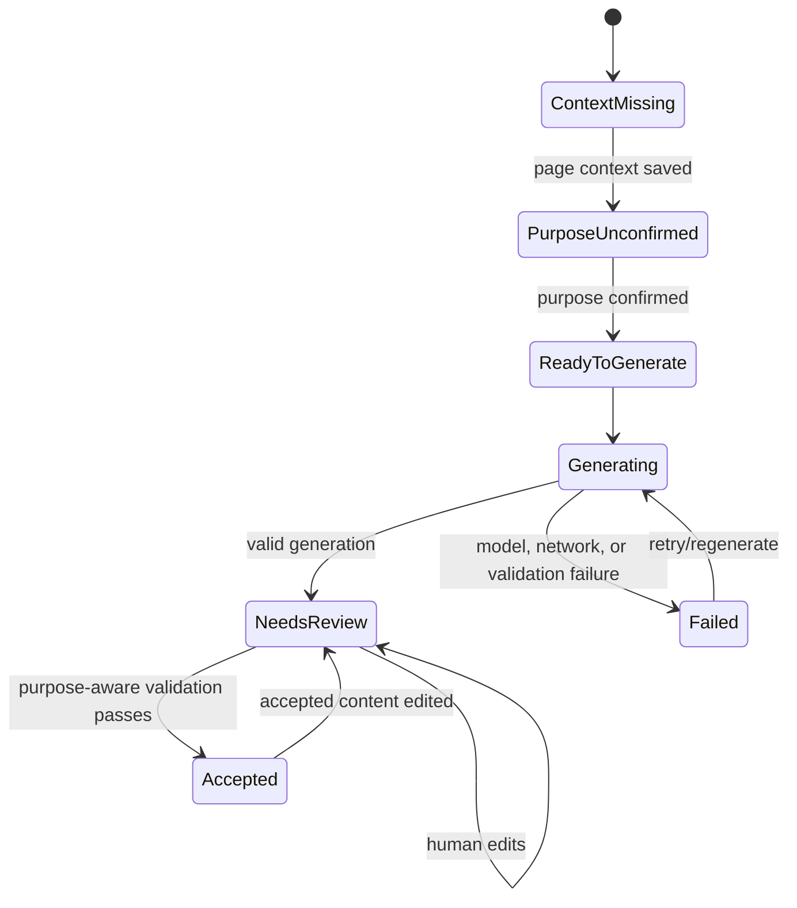
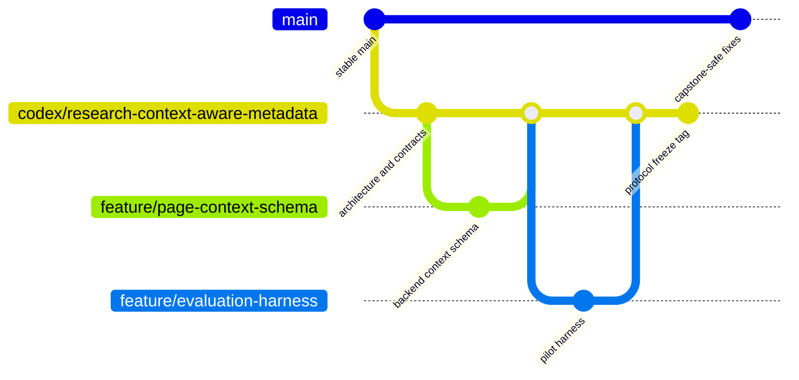

# SEO Studio Research Master Architecture and Execution Plan

Status: Canonical architecture, research protocol, paper guide, and agent execution specification
Version: 2.3
Prepared: July 13, 2026
Updated: July 19, 2026
Project: PROG8751 SEO Studio Capstone
Research repository: `https://github.com/franklinnweke/seo-studio-research`
Original team capstone repository: private; URL intentionally omitted from the public research edition
Target outcome: capstone delivery, institutional publication, and a reproducible applied-AI research artifact
Working article: [`docs/publication/seo-studio-manuscript.html`](publication/seo-studio-manuscript.html)
Documentation index: [`docs/README.md`](README.md)
Compact current context: [`docs/research-context.md`](research-context.md)
Current execution checklist: [`docs/research-next-steps.md`](research-next-steps.md)

## 1. Purpose of this document

This is the execution source of truth for extending SEO Studio into a context-aware web image metadata system and producing a defensible publication from the work. It is written for teammates, future maintainers, coding agents, research assistants, reviewers, and the professor supervising the project.

This version consolidates the original technical architecture and the separate July 2026 research implementation guide. When another plan, chat message, backlog, or calendar conflicts with this document, this document controls until an architecture decision record explicitly changes it.

The document is intentionally more complete than a normal implementation plan. An implementer should not have to invent the system boundary, research protocol, data model, server-access model, experimental controls, paper structure, or definition of done.

It covers:

- the current application and deployment architecture;
- how the current code reaches Ollama and the NVIDIA DGX Spark server;
- the connection ambiguity and security gaps that must be resolved;
- the target product and research architecture;
- required backend, frontend, infrastructure, data, testing, and CI changes;
- branch and release strategy;
- the model-evaluation harness and evidence format;
- dataset, annotation, statistics, ethics, authorship, and reproducibility requirements;
- the complete paper structure and required tables, figures, statements, and appendices;
- roles for people and coding agents;
- implementation gates, acceptance criteria, risks, and handoff requirements.

### 1.1 How an agent must use this document

An implementation agent must:

1. Read the repository `AGENTS.md` files and this entire document before changing code.
2. Inspect `git status`, the active branch, recent commits, tests, environment examples, and relevant implementation files.
3. Preserve unrelated user or teammate changes. Never reset, discard, silently reformat, or absorb them into research commits.
4. Identify the current governance gate and execute only the next approved work package.
5. Run proportionate tests and document commands, outcomes, changed files, unresolved risks, and the next safe action.
6. Treat examples containing dates, model names, thresholds, or counts as provisional until the applicable gate freezes them.
7. Never place passwords, SSH keys, public/private server inventories, reviewer identity maps, client data, or raw restricted research records in Git.
8. Invoke `$davneet-dgx-access` for every live DGX access, status, inventory, connectivity diagnosis, server command, or experiment handoff. Follow the skill's required current-status check before making a live-state claim; do not reproduce its connection profile in this repository.

### 1.2 Repository snapshot at version 2.3

This snapshot is evidence for handoff, not a permanent claim. Re-check it at the start of every task.

- Public research release branch: `main`, preserving the complete history of the original `codex/research-context-aware-metadata` development lineage.
- Latest research foundation commit before the completed live repair evidence: `1179475` (`Record amendment and add truncation repair protocol`).
- The upload/deletion workflow was preserved separately on `agent/automatic-upload-flow` at commit `5f6d137`; draft PR #33 targets `main`.
- The research branch was created from the clean `main` baseline so PR #33 is not silently absorbed into the research work.
- Root `.env` and the private GX10/DGX access note are ignored. A placeholder-only root `.env.example` documents safe Docker Compose substitution.
- The evaluation package now includes the 20-image licensed pilot, a separate synthetic contract fixture, candidate/license evidence, immutable compatibility records, schema validation, multi-block normalization, run accounting, blinding, an anchored annotation rubric, and compatibility reporting.
- `$davneet-dgx-access` is the canonical operational authority for live DGX access. Its connection profile and current-status baseline remain outside this repository; committed documents contain only sanitized protocol requirements and research evidence.
- The application has upload, optimization, page/brand context, human-confirmed purpose, purpose-aware review/export, structured visual facts, direct/dual routing, sanitized provenance, and Ollama telemetry behind the research feature flag.
- The research harness is separate from the product path and sends raw image bytes only at execution time while persisting image hashes in sanitized request evidence.
- The full 20-item compatibility matrix, fixed-writer compatibility pass, separate two-model Qwen3.6 amendment, both source-linked Protocol 2.2 repair stages, and the 54-call fixed-writer metadata matrix are complete with sanitized evidence under `evaluation/results/`. On the original deployed Ollama 0.24.0 stack, Qwen3.5 9B and Gemma 3 12B meet the unchanged 95% fact-pipeline-validity gate; Qwen2.5-VL 3B remains the reference. A pre-freeze catalog correction prospectively tested same-size Gemma 4 on an official project-owned Ollama 0.32.1 runtime with an 8192-token common context. In that isolated block, the reference reached 20/20, Qwen3.5 reached 19/20 after its single repair, and Gemma 4 reached only 18/20 after three repairs, so Gemma 4 failed the unchanged gate. The protocol reassessment retains the original same-runtime reference/Qwen3.5/Gemma 3 set for a deployed SEO Studio stack comparison and reports Gemma 4 as a current-generation exclusion. The supervisor acknowledgement was relayed on July 18, 2026 and is recorded in sanitized form at `evaluation/configs/supervisor-acknowledgement-20260718.json`; the supervisor's identity and communication artifact remain private. The leakage-checked reviewer package contains 60 balanced cells: 46 schema-valid metadata outputs and 14 explicit failures. The initial calibration was preserved, rubric v1.1 was applied, and two reviewers then independently completed a common 76-item human-check inventory across the same 15 blinded items. Recalibration achieved 98.7% exact human-check label agreement (Cohen's kappa 0.923), 91.7% exact valid-output disposition agreement (linear-weighted kappa 0.860), and a 120-second median item time for each reviewer. Calibration is ready and primary quality annotation is authorized. No quality winner has been selected. The approved 128-image dataset is now materialized and preflight-ready; protocol freeze, full experiments, statistical analysis, and final manuscript results remain pending. The working article lives at `docs/publication/seo-studio-manuscript.html`.
- Gate 4 has a structurally validated draft at `docs/publication/protocol-freeze-v1.md` and `evaluation/configs/full-study-protocol-v1.draft.json`. It excludes pilot/calibration items from primary inference, resolves the five-screened-versus-three-advanced design, fixes one primary outcome per RQ, and accounts for 3,012 planned stage cells and 1,071 reviewer assignments under the approved estimation-first design. The final manifest, deterministic execution plan, and separate backup are valid. The draft does not authorize execution until listener-security evidence is complete, the status is deliberately changed, and the audit reports `freeze_ready`.
- On July 23, the 128-item final Commons dataset was materialized with exact 32-per-domain balance and frozen 128/64/36 analysis populations. The project-author recheck preserved eight rejected rows, and eight unique additive same-stratum replacements were accepted through a guarded reconciler that inherits each rejected row's population flags. The final manifest has 128 unique IDs and 128 unique image hashes, fresh 1280px Commons evidence, accepted human-check records, and verified licence, context, and brand hashes. The offline full-study preflight reports `ready` with zero errors and warnings.
- On July 22, the project author confirmed manual review of every candidate and every substantive image, fact, prohibited-boundary, alt-example, and required-check decision. The completed 128-row export contains 128 accepted items and passes the official no-write importer. Agentic help generated only a mechanical accepted-item completion note; it did not make the decisions, and the note prose is excluded from analysis. A deterministic 24-cell, context-isolated Codex diagnostic was then run for internal quality control only. It found eight whole-image differences, 13 visible-fact differences, no prohibited-boundary differences, and one alt-example difference. These are not paper results or calibrated reviewer-agreement estimates. The project author remains authoritative and will recheck the eight whole-image disagreements plus two additional proposal-only items before the export is applied.
- The project-author reconciliation is now complete. The author manually rejected all eight flagged whole-image items and corrected the two additional proposal-only items. The resulting 128-row artifact contains 120 accepted and eight rejected records. This does not reduce the approved population: the importer correctly blocks application until eight additive human-accepted replacements are supplied from the same domain/query/purpose strata. Rejected evidence and the original export remain preserved, replacements inherit the affected fixed analysis-population assignments, and neither the diagnostic rates nor the agent-assisted note wording enter the paper as research outcomes.
- On July 19, 2026, the project lead relayed all governance approvals. The repository records the relay without private identities or communications. A required `$davneet-dgx-access` read-only check then reverified Ollama 0.24.0 and exact full digests for the three primary models, with no model loaded and no mutation. It also verified a dedicated project workspace, available storage, and a limited telemetry path based on Ollama timings plus process/system memory; `nvidia-smi` remains unavailable, so the paper may not claim complete GPU VRAM or measured energy. A private reachability check failed the listener-security boundary and requires approved mitigation before execution. The approved five-point RQ1 meaningful effect triggered a pre-data sensitivity calculation; the resulting practical estimation-first decision fixes 128 images and preserves the effect as an interpretation threshold without claiming comprehensive confirmatory power. Gate 4 therefore remains blocked only on listener-security remediation and the deliberate final status transition—not on governance, model identity, sample size, workload approval, or dataset materialization.

### 1.3 Authority hierarchy

Use the following order when deciding what to do:

1. School policy, ethics determination, professor direction, and repository `AGENTS.md` instructions.
2. This master document and approved ADRs.
3. Frozen protocol and tagged experiment configuration.
4. Current sprint issue or agent work package.
5. Older plans, chat summaries, and informal notes.

After protocol freeze, the frozen protocol outranks later convenience changes. Any deviation must be recorded and must not overwrite the original evidence.

## 2. Executive decision record

The project should proceed under the following decisions unless the team and professor explicitly approve a revision.

1. The research contribution is not “we built an SEO application.” It is a controlled evaluation of self-hosted multimodal pipelines for grounded, context-aware web image metadata.
2. The paper focuses on image metadata. AI crop targeting remains a capstone feature and future research direction, not a second primary task in this paper.
3. The publication screens five multimodal candidates, then advances the current baseline plus the two highest-ranked eligible challengers to expensive end-to-end evaluation.
4. Page context and human-confirmed image purpose are first-class inputs. Brand context alone is insufficient for general accessibility claims.
5. The product may suggest image purpose, but a person confirms it before final metadata approval.
6. Decorative and redundant images must support empty alt text. Informative, functional, text-containing, and complex images follow purpose-specific validation.
7. The production application and research harness are separate execution paths. They may share schemas and prompts, but experiments do not run through browser clicks or mutable product state.
8. The research harness runs on the DGX Spark whenever possible. This separates inference performance from network and web-application overhead.
9. Ollama must not be exposed unauthenticated to the public internet. Access uses a private network, host-private Docker path, SSH tunnel, or institution-approved secure overlay.
10. Model names are never sufficient provenance. Every experiment records the immutable model digest, quantization, Ollama version, code commit, prompt hash, image hash, hardware snapshot, and run configuration.
11. The existing `main` branch remains the stable capstone baseline. Research features are integrated on a long-lived research branch through short, reviewed feature branches.
12. The paper can be Franklin-led and Franklin-first-author, but the system cannot be represented as solely built by Franklin. Authorship and CRediT roles are agreed before full data collection.
13. No claim of “published,” “WCAG compliant,” or “best model” is made before the relevant evidence and approval exist.
14. The controlled architecture ablation uses Qwen3.5 9B in both direct and decomposed conditions; a separate production-system comparison evaluates the selected vision model plus writer against direct generation.
15. Human raters score only one predeclared repeat. Other measured repeats quantify stability and performance and are never searched for a best-looking output.
16. The master document remains complete and canonical through A0–A2. Later operational views may be generated without removing authoritative content from this file.

## 3. Research thesis and proposed contribution

### 3.1 Recommended working title

**Evaluating Self-Hosted Multimodal Pipelines for Context-Aware Web Image Metadata**

Alternative systems-oriented title:

**Quality, Grounding, and Deployment Trade-offs in a Human-in-the-Loop Multimodal Pipeline for Web Image Metadata**

### 3.2 Central thesis

Web image metadata should not be generated from pixels alone. Useful alt text depends on the image's role, surrounding page content, and intended audience, while brand context should influence terminology without becoming evidence of visible content. A decomposed vision-plus-writer pipeline may improve control and grounding, but that benefit must be measured against direct multimodal generation, latency, reliability, and deployment cost. A project-level motivation for self-hosting is to reduce paid external API usage when metadata is generated across large image collections; this is an economic hypothesis, not an assumed saving, because local hardware, energy, storage, maintenance, and operator time also have costs.

### 3.3 Proposed contributions

The paper should claim only contributions actually completed and released:

1. A licensed, context-rich benchmark for web image metadata.
2. A five-condition compatibility screen followed by a controlled primary quality comparison of the three prospectively advanced deployed-stack conditions.
3. An ablation of image-only, brand-aware, page-aware, and combined context.
4. An ablation of direct multimodal generation versus a two-stage visual-facts-plus-writer pipeline.
5. A reproducible Ollama/DGX Spark evaluation harness with raw evidence and deployment telemetry.
6. A model-selection framework using grounding, purpose-aware metadata appropriateness, reliability, latency, resource use, and operational-cost trade-offs.
7. A human-review application implementing the selected workflow.

### 3.4 Research questions

RQ1. After the five-condition compatibility screen, how accurately do the three prospectively advanced self-hosted multimodal conditions extract grounded visual facts for web image metadata?

RQ2. Does decomposing generation into visual-fact extraction and contextual writing reduce unsupported claims and improve metadata acceptability compared with direct generation using the same model?

RQ3. How do brand context and page context affect alt-text usefulness, terminology, redundancy, and unsupported claims?

RQ4. What quality, reliability, latency, resource, and operational-cost trade-offs determine the most suitable deployment configuration for SEO Studio?

Purpose suggestion remains an exploratory product feature, not a primary research question in this paper.

## 4. Scope

### 4.1 In scope

- Existing upload, optimization, conversion, metadata, review, approval, and export workflows.
- Page-level and image-level context.
- Human-confirmed image-purpose classification.
- Purpose-aware alt-text decisions, including empty alt text.
- Self-hosted Ollama inference on DGX Spark or equivalent institutional hardware.
- Vision-model screening and dual-stage metadata generation.
- Direct-generation and context ablations.
- Model, prompt, runtime, latency, reliability, and system provenance.
- Licensed research dataset, blinded human review, inter-rater agreement, and statistical analysis.
- Publication manuscript, technical report, data/code availability statements, and portfolio-safe summary.

### 4.2 Out of scope for the primary paper

- Training or fine-tuning foundation models.
- Proving full WCAG compliance.
- Enterprise-scale queues, Kubernetes, billing, or multi-tenant architecture.
- Automatic CMS publishing.
- A general benchmark for every possible image type or language.
- AI crop quality as a co-primary outcome.
- Comparing cloud proprietary models unless added later as a clearly separate reference condition.
- Using model-reported confidence as ground truth.
- Treating LLM-as-judge scoring as the only quality evidence.

### 4.3 Publication claim boundary

If page context and image purpose are not completed, remove “context-aware” and broad accessibility language from the title and claims. The narrower paper may evaluate grounded SEO-oriented metadata for informative photographs only.

## 5. Current system architecture

### 5.1 Current logical flow



### 5.2 Current component inventory

| Component | Current responsibility | Important current behavior |
|---|---|---|
| Next.js frontend | Authentication, upload, settings, metadata review, crop UI, exports | Uses Axios and TanStack Query; active image job is stored in browser local storage |
| FastAPI backend | API, auth validation, file processing, AI calls, persistence, exports | Most AI calls are synchronous; protected routes depend on Supabase auth |
| Local file persistence | Job state and generated files | `job.json` stores mutable workflow state; binary files are stored on disk |
| Ollama client | Sends prompts and Base64 images | Uses `/api/generate`, `stream: false`, and temperature `0`; returns only response text |
| Vision stage | Produces short factual visual description | Current default `qwen2.5vl:3b`; output is truncated to 240 characters |
| Language stage | Writes metadata from visual facts and brand context | Current default `qwen3.5`; retries malformed JSON once |
| Review workflow | Edits and approvals | Requires filename, alt text, and caption to be non-empty |
| Docker Compose | Deploys frontend and backend | Backend points to `host.docker.internal:11434` unless overridden |
| GitHub Actions | No active public-repository deployment workflow | The inherited staging workflow was removed; CI and hosting remain explicit future work |

### 5.3 Current quality status

Verified July 16, 2026 on the research branch:

- backend test suite: 96 passing after the A4 context-workflow slice;
- offline evaluation harness: 32 passing tests plus successful contract and licensed 20-item pilot preflight;
- frontend lint: passing;
- frontend production build: passing with Next.js 16.2.6;
- `git diff --check`: passing for the A0 changes;
- research branch: `codex/research-context-aware-metadata` at baseline commit `aabeae3` before A0 edits;
- upload/deletion work: isolated on `agent/automatic-upload-flow` at `5f6d137` with draft PR #33;
- `$davneet-dgx-access` live check at 2026-07-16 12:27 EDT: key-based access succeeded to the expected aarch64 host; Ubuntu 24.04.4 LTS and Ollama 0.24.0 were reported; the Ollama service was active; no model was loaded at check time;
- governance confirmation from the project team: the DGX Spark is owned by the project supervisor/program coordinator, and the team has permission to use it for the capstone and related research. This authorization does not permit deletion, overwriting, relocation, or repurposing of the owner's existing files or shared resources;
- current research inventory: `qwen2.5vl:3b`, `qwen2.5vl:32b`, `qwen3.5:latest`, `gemma3:12b`, and `mistral-small3.1:24b` are installed with full digests recorded in `evaluation/configs/models.toml`; 294 GiB remained free after the two approved additive pulls;
- MiniCPM-V 4.5 failed at registry manifest resolution with HTTP 412 because it requires a newer Ollama runtime. No model layer was installed and the shared runtime was not upgraded. The predeclared runtime-incompatibility rule replaced it with the already-installed Qwen2.5-VL 32B condition before comparative quality analysis;
- the listener was reported on all interfaces, but firewall rules and external reachability were not verified. Gate 1 therefore remains open and the deployment must not yet be described as securely private;
- ordinary `nvidia-smi` did not communicate with the NVIDIA driver in this session. This does not by itself establish a driver fault on a unified-memory DGX Spark; the supported DGX telemetry path still needs confirmation.
- first A1 code slice: authenticated sanitized `/api/ai/health`, private Ollama URL/storage removal from frontend settings, pooled structured Ollama generation results with native telemetry and request IDs, updated frontend contract, and regenerated OpenAPI contract are implemented locally with fake-transport tests.
- first A2 slice: schema-version-2 image jobs, legacy context defaults, page-context `GET/PUT`, per-image-context `GET/PUT`, the complete seven-state purpose taxonomy, explicit human confirmation, feature-flagged purpose-aware approval, decorative/redundant empty-alt support, matching TypeScript contracts, and regenerated OpenAPI are implemented and tested.
- A5 harness slice: a visually checked and licensed 20-image pilot spans four equal domains and all six declared purposes; materialization preserves license evidence, hashes, dimensions, fictional contexts, reference facts, and forbidden claims. Five one-image cold compatibility attempts were schema-valid with no hidden retry; multi-block accounting was complete; normalization succeeded; the five-condition reviewer package passed model-identity leakage checks; raw records and the private map remain ignored. The warm compatibility runner now verifies live digests, randomizes model blocks and per-model image order from the frozen seed, records one declared synthetic warm-up per active model block, checkpoints every measured attempt append-only, supports evidence-safe resume, and unloads each model after its final pending item.
- A5 evidence explicitly forbids quality ranking from the one-image smoke, completed five-condition compatibility matrix, five-call writer pass, completed Qwen3.6 amendment, and completed Protocol 2.2 repair stage. Supervisor acknowledgement is relayed and sanitized, the balanced blinded metadata package has passed leakage checks, and common-inventory recalibration under rubric v1.1 is ready. Gate 3's technical calibration requirement is satisfied; administrative evidence completion and the explicit protocol-freeze decision remain separate actions.
- The first full-matrix collection attempt on July 16, 2026 is classified as infrastructure-aborted and excluded from compatibility estimates. A localhost-only SSH tunnel reset during the ninth Mistral measured request while the host and Ollama service remained continuously active; the original runner then incorrectly recorded all remaining planned calls as immediate connection failures. All raw records are preserved, none are attributed to model incompatibility, and the corrected runner now aborts after the first recorded transport failure. Recollection must use a new run ID, a keepalive-protected tunnel, and the committed corrected criteria hash.
- Because the first forwarding session reset after approximately 50 minutes, clean recollection may use predeclared operational segments via `--max-new-attempts`. Each segment preserves the same model/image order and generation contract, checkpoints measured attempts append-only, records a separate session warm-up, unloads the active model at the boundary, and resumes the same run ID without duplicating completed keys. Operational segmentation is not an experimental condition and must be reported when interpreting latency.
- Warm-up diagnostics distinguish Ollama HTTP inference rejection from transport loss. The original PPM contract fixture exposed an unsupported-input path and, on Mistral, could consume much of the forwarding-session lifetime before rejection. The warm-up now uses a hash-pinned PNG derivative of the same synthetic blue square; the original PPM remains preserved as historical contract evidence. Warm-up validity does not enter the licensed 20-item denominator, and only a true connection/transport failure triggers immediate run abort.
- Repeated WAN resets require explicit infrastructure recovery. The compatibility criteria permit at most three separately recorded collection attempts for an item when and only when the preceding attempt ended in a transport error. Each recovery names the superseded attempt, the runner stops between attempts, and raw transport failures remain counted in infrastructure reporting. The first non-transport outcome is the sole compatibility outcome for that model/image key; this is not a hidden validation retry and cannot be used for schema-invalid or low-quality outputs.
- A request reaching the frozen 240-second limit is an `inference_timeout`, not a recoverable connection failure, and is a final compatibility outcome. Two legacy records for the same Mistral/pharmacy key were created before this distinction was implemented; the first timeout is the analysis outcome, the second remains immutable as a disclosed implementation deviation, and no third timeout attempt is permitted.
- During bounded recovery of a Qwen3.5 transport reset, one direct TCP request remained blocked locally for approximately 17 minutes even though a `$davneet-dgx-access` status check found the host and Ollama healthy with no model loaded. The project-started controller was stopped without changing the server; no measured record was created for the unresolved socket call. This is a disclosed collection implementation deviation. The transport now adds an OS-level absolute deadline around the existing socket timeout, segmented summaries derive the run start from immutable prior records, and tracked Git changes—not unrelated untracked user material—control the provenance dirty marker.
- The clean recollection completed 100/100 analyzed outcomes with 105 immutable measured records: 100 selected outcomes, four superseded transport failures, and one legacy duplicate-timeout deviation. Schema-validity was Gemma 3 12B 19/20 (95%, pass), Qwen3.5 9B 18/20 (90%, fail), Mistral Small 3.1 24B 17/20 (85%, fail), Qwen2.5-VL 3B baseline 16/20 (80%, fail), and Qwen2.5-VL 32B fallback 15/20 (75%, fail). These results establish only compatibility under the frozen contract and do not rank factual quality.
- Because only Gemma met the original one-shot 95% gate, the predeclared requirement for two eligible non-baseline challengers was initially unsatisfied, and the completed Qwen3.6 amendment did not resolve that deficit. Protocol 2.2 subsequently evaluated an explicit system-level truncation policy without altering the one-shot evidence or lowering the threshold. Under that pre-freeze policy, Qwen3.5 and Gemma both meet the 19/20 pipeline-validity gate. The Qwen2.5-VL 3B baseline remains below gate and may appear only as a reference condition, not an eligible production finalist.
- The separately frozen writer check selected `education-library-study-017` as the lexicographically first image with valid facts from every candidate. The pinned Qwen3.5 writer produced schema-valid, purpose-aware metadata for all five source-fact conditions (5/5), with thinking disabled, no pixels sent to the writer, no hidden retries, and no transport recoveries. This closes writer compatibility only; it does not answer RQ2 or compare metadata quality.
- The required post-run `$davneet-dgx-access` check found the expected host and Ollama service healthy and no model loaded. No service, binding, firewall, package, model-storage, or owner-file mutation was made.
- A subsequent read-only `$davneet-dgx-access` inventory inspection found two already-installed, vision-capable Apache-2.0 Qwen3.6 packages: a 27.8B dense variant and a 36.0B MoE variant from the 35B-A3B family. Their full live digests are locked only in a separate amendment configuration. They were selected before output inspection, require no pull or runtime change, and must use the original compatibility contract unchanged.
- The amendment completed 40/40 analyzed outcomes with 42 immutable raw records: 40 selected outcomes and two transport failures superseded by explicitly linked bounded recoveries. Dense Qwen3.6 completed 15/20 valid outcomes (75%; four timeouts and one output truncation), while Qwen3.6 MoE completed 13/20 (65%; seven output truncations). Neither met the 95% gate, so the amendment failed to create the required advancement set. The temporary localhost-only tunnel was closed, the post-run skill check found no model loaded, and no server configuration or owner file was changed.
- `evaluation/configs/candidate-amendment-20260717.json` is the completed amendment decision record. It preserves the original matrix as immutable evidence, documents the selection rule and unchanged controls, and records that supervisor acknowledgement remains required before final protocol freeze even though execution was authorized within the approved project-use rights.
- Failure-taxonomy review established that every schema-invalid outcome in both complete matrices ended with Ollama `done_reason=length`. These are now reported as `output_truncated`, not generic schema failures. The affected population is exactly 15 source outcomes across Qwen2.5-VL 3B (4), Qwen3.5 9B (2), Gemma 3 12B (1), dense Qwen3.6 (1), and Qwen3.6 MoE (7). Timeout outcomes are excluded.
- Protocol 2.2 treats truncation handling as an explicit system-level compatibility policy before the final protocol freeze: retain the immutable 384-token first attempt; allow exactly one source-linked 768-token recovery only after `done_reason=length`; keep the same image, prompt, schema, model digest, seed, temperature, thinking mode, and 240-second deadline; and permit no quality retry, timeout retry, or further validation retry. `evaluation/results/truncation-repair-plan-20260717.json` freezes all 15 repairs before execution. The 95% pipeline-validity gate is unchanged, and one-shot and repaired results must be reported separately.
- Protocol 2.2 completed all 15 frozen repairs: 6 were schema-valid and 9 remained invalid, with no transport failures or hidden retries. Pipeline validity was Qwen3.5 19/20 and Gemma 19/20 (both pass); Qwen3.6 MoE 18/20, Qwen2.5-VL 3B 16/20, dense Qwen3.6 15/20, Qwen2.5-VL 32B 15/20, and Mistral Small 3.1 17/20 (all fail). The resulting quality-screening set is the Qwen2.5-VL 3B reference plus eligible Qwen3.5 and Gemma challengers. This formation is a compatibility decision only; comparative quality remains uninspected and no winner has been selected.
- The post-run `$davneet-dgx-access` check found the expected host and Ollama service healthy with no model loaded. The localhost-only tunnel was closed, and the run made no service, firewall, binding, package, model-storage, or owner-file change.
- A pre-freeze catalog audit identified a candidate-selection error: Gemma 4 was available before the July 2026 set was finalized, so Gemma 3 cannot be described as the current Gemma generation. `evaluation/configs/gemma4-candidate-amendment-20260717.json` preserves the completed Gemma 3 evidence, pauses quality screening, and predeclares an additive, same-size `gemma4:12b-it-q4_K_M` compatibility amendment under the unchanged one-shot and Protocol 2.2 controls. Selection occurred before the package pull or any task-output inspection.
- The original Gemma 3 condition remains scientifically defensible for a narrower claim: it was an installed, deployment-compatible, 12B-scale cross-family comparator selected under the shared Ollama 0.24.0 system boundary and tested before comparative quality inspection. Its evidence is not discarded or relabelled. What is not defensible is calling Gemma 3 the newest or current Gemma generation after Gemma 4 availability was discovered. The protocol therefore reports Gemma 3 as legacy deployed-stack evidence and uses the prospectively frozen Gemma 4 amendment for the current-generation comparison.
- The first predeclared Gemma 4 pull stopped at registry manifest resolution with HTTP 412 because the shared Ollama 0.24.0 runtime does not support the package. The post-attempt `$davneet-dgx-access` check confirmed the service remained healthy, no model was loaded, Gemma 4 was not installed, and existing models were unchanged. This documented incompatibility motivated the subsequently authorized isolated runtime; the shared service was not upgraded.
- The project team selected the isolated-runtime option. The official Ollama 0.32.1 ARM64 archive and separate model store were installed in a project-owned location with a loopback-only listener; all three packages are digest-locked in `evaluation/configs/models-isolated-gemma4.toml`, with sanitized installation evidence in `evaluation/configs/isolated-runtime-evidence-20260717.json`. Qwen2.5-VL 3B and Qwen3.5 retained exactly the same digests as the original shared-runtime conditions. The authorization excluded shared-service restart or upgrade, existing-model-store mutation, owner-file changes, duplicate generation, and comparative inspection before blinding. The isolated 60-output pilot fixed `num_ctx=8192` for internal comparability and ultimately served as compatibility/exclusion evidence; because Gemma 4 failed the gate, it does not supply the quality-screening package.
- The isolated one-shot matrix is complete at the clean pre-inference commit `e15817b`: 60 analyzed outcomes, 62 raw measured records, and two source-linked bounded transport recoveries. Schema validity was Qwen2.5-VL 3B 20/20, Qwen3.5 18/20, and Gemma 4 17/20. Failure-metadata review identified four and only four Protocol 2.2 triggers—one Qwen3.5 and three Gemma 4 outputs with `done_reason=length` at 384 tokens. A separate Qwen3.5 240-second inference timeout is final and excluded from repair. `evaluation/results/truncation-repair-isolated-gemma4-plan-20260718.json` freezes the four repair calls before execution. No generated claims were comparatively inspected and no quality winner was selected.
- The isolated Protocol 2.2 stage completed at clean repair commit `e3d5abd`: Qwen3.5 repaired 1/1 and reached 19/20 pipeline validity; Gemma 4 repaired 1/3 and reached 18/20. Gemma 4 therefore failed the unchanged 95% gate and is excluded from quality screening. The post-run `$davneet-dgx-access` check confirmed the temporary tunnel closed, the project-owned isolated service and loopback listener stopped, the shared service healthy, and no shared model loaded. No shared service, owner file, or existing model was changed or deleted.
- Protocol reassessment resolves the failed current-generation amendment by narrowing the primary paper to model selection for the deployed SEO Studio DGX/Ollama system rather than an exhaustive newest-model benchmark. The quality-screening population returns to the original same-runtime Qwen2.5-VL 3B reference plus gate-eligible Qwen3.5 and Gemma 3 challengers. Gemma 3 is defensible only as a deployed-stack-compatible legacy-generation comparator; it must not be called current, newest, globally best, or representative of all open multimodal models. Gemma 4 remains visible as a prospectively tested current-generation exclusion, not silently discarded evidence.
- Supervisor approval for the deployed-stack scope and the next non-destructive DGX stage was relayed by the project team on July 18, 2026. `evaluation/configs/supervisor-acknowledgement-20260718.json` records the approved scope and preservation boundary without fabricating or committing the supervisor's identity or private communication. The private identity/evidence record remains an administrative closure item, not a reason to block the approved writer-matrix work.
- A construct audit found that the 60 selected source outcomes are `VisualFactsPayload` records, not reviewer-ready metadata. The anchored rubric scores filename/alt/caption/purpose behavior, so directly blinding those fact records would be invalid. The frozen `writer-matrix-v1` contract therefore sends each of the 54 schema-valid effective fact records through the same digest-pinned Qwen3.5 writer with no pixels, thinking disabled, temperature 0, seed 20260716, an 8192-token context, a 420-token output limit, no hidden or validation retries, and bounded infrastructure recovery only. The six invalid upstream cells remain explicit null pipeline failures. The resulting reviewer population is exactly 60 balanced condition/image cells; writer-stage failures, if any, remain failures.
- The fixed-writer matrix completed at clean contract commit `08e7127`: 54/54 writer calls, 46 schema-valid metadata outcomes, 8 final schema-invalid outcomes, no transport failures or recoveries, and no hidden or validation retries. Together with the six preserved upstream failures, structural pipeline validity is 46/60. By source condition, the writer produced 14/16 valid baseline-fact outputs, 16/19 valid Qwen3.5-fact outputs, and 16/19 valid Gemma 3-fact outputs; including upstream failures, the condition-level structural totals are 14/20, 16/20, and 16/20. These are reliability outcomes, not human quality rankings.
- Metadata normalization retained all 60 source cells and all seven Protocol 2.2 repair links. Automated blinding produced three anonymous conditions with 20 cells each, 60 unique review IDs, and only public reviewer fields. Both the built-in leakage check and an independent identity-string scan passed. The private mapping remains under the ignored `evaluation/annotations/private/` boundary. The deterministic calibration subset contains five images crossed with all three blinded conditions (15 items; 12 valid and 3 explicit failures) plus a reviewer timing template. Calibration items have been human-scored, but primary comparative scoring and model selection have not begun.
- On July 18–19, R1 and R2 independently returned 15 complete schema-valid calibration records, R3 returned 15 adjudicated records, and both timing files covered all items without duration mismatches or overlap. R1 and R2 median item times were 120 and 125 seconds, projecting approximately 120 and 125 active minutes respectively for 60 items before adjudication overhead. The first pass is preserved under the ignored private annotation boundary and hash-linked from `evaluation/results/calibration-analysis-20260719.json`.
- The preserved first pass did not establish human-check label agreement because reviewers segmented different atomic populations. Rubric v1.1 therefore froze atomic deduplicated units, system-failure null handling, functional-alt, redundancy, brand-term, and grounding-cap clarifications. In the completed recalibration, R1, R2, and the adjudicator each used the same 76-item human-check inventory; R1/R2 exact human-check label agreement was 98.7% with Cohen's kappa 0.923. Across the 12 valid outputs, factual-grounding exact/weighted agreement was 91.7%/0.935, salient coverage 83.3%/0.826, redundancy control 91.7%/0.942, and valid-output disposition 91.7%/0.860. These are reviewer-feasibility diagnostics, not model-quality results.
- On July 19, 2026, before primary output inspection, the project lead approved the practical estimation-first design after reviewing the pre-data sensitivity analysis: 128 licensed images balanced 32 per domain; all 128 images in RQ1 and the controlled Qwen3.5 direct-versus-decomposed comparison; a deterministic 64-image subset for the other production metadata systems; and a nested 36-image context-ablation subset. The design plans 3,012 stage cells, 876 unique human-review items, and 1,071 assignments distributed across three independently calibrated reviewers. It prioritizes effect estimates and confidence intervals and does not claim guaranteed power for a five-percentage-point RQ1 effect. The pinned plan retains invalid-upstream downstream cells as explicit failures while suppressing calls that cannot be validly made.
- On July 23, 2026, the seeded plan was generated and independently regenerated byte-for-byte: 1,536 primary-generation cells, 1,152 decomposed-writer cells, and 324 deferred context-ablation cells. The context cells cannot be resolved until the frozen vision-selection rule produces an immutable selection record. Append-only resume, one recorded transport recovery, plan/record drift rejection, clean-worktree enforcement, live-digest checks, storage checks, and draft-protocol rejection are implementation stop conditions, not analyst discretion.
- A4 slice: the feature-flagged frontend now collects page context, requires explicit per-image purpose confirmation, exposes optional AI purpose suggestions without conflating them with human decisions, gates generation/approval on contextual readiness, supports direct and dual-stage selection, and presents purpose, warnings, structured facts, and sanitized provenance during review. The workflow is keyboard operable, has responsive no-overflow behavior at 390 px, and preserves legacy metadata mode when the feature flag is disabled.

Current private addresses, usernames, key locations, and SSH authentication details are operational data owned by `$davneet-dgx-access` and its private status material. Do not copy them into the repository. The committed protocol records sanitized evidence, required security properties, and preflight outcomes only.

## 6. Current DGX Spark and Ollama connection analysis

The user has referred to the machine as a “DJX pack.” The live system identifies as the expected aarch64 GX10 host. The project supervisor/program coordinator owns it and has granted the team project-use rights. Its exact marketed hardware identity, approved data boundary, and network policy still require confirmation before the publication pilot.

### 6.0 Canonical operational access authority

All live DGX work must invoke `$davneet-dgx-access`. This includes connection checks, SSH use, Ollama health and model inventory, product-connectivity diagnosis, experiment preflight, smoke tests, and any server command. The skill requires its `scripts/check-status.sh` check before claims about current server state; its `references/current-status.md` is a last-known baseline, not a substitute for that check.

The separation of authority is intentional:

- this master document defines research requirements, evidence fields, security constraints, and gates;
- `$davneet-dgx-access` defines the approved operational connection workflow and current live baseline;
- experiment records contain sanitized reproducibility evidence such as versions, immutable model digests, quantization, resource snapshots, and timings;
- private host, user, key, and reachability details remain outside Git.

The skill does not broaden authorization. Project use is approved, but model pulls, service changes, firewall changes, reboots, destructive commands, and GPU-consuming experimental runs still require explicit operator or user approval. Never delete, overwrite, move, rename, truncate, or repurpose the owner's existing files or shared resources; ambiguous resources are owner-managed and must remain untouched.

### 6.1 Current connection mechanisms in the repository

There are four connection assumptions:

| Execution path | Configuration source | Current expected Ollama address |
|---|---|---|
| FastAPI started manually from `backend/` | `backend/.env` through Pydantic settings | Defaults to `http://localhost:11434` |
| `scripts/dev.sh` | Starts FastAPI from `backend/`; inherits exported shell variables and reads `backend/.env` | Defaults to `http://localhost:11434` unless variables are exported |
| Docker Compose from repository root | Ignored root `.env` copied from safe `.env.example`, or Compose defaults | Defaults to `http://host.docker.internal:11434`; private overrides remain local |
| Future hosted environment | Deployment-specific secrets and environment variables | Must use an approved private inference path; no public-repository deployment is configured |

The environment source is intentionally explicit by execution mode:

- manual backend and `scripts/dev.sh`: `backend/.env` plus exported shell variables;
- Docker Compose: ignored root `.env`, created from the safe root `.env.example`;
- future hosting: deployment-managed secrets and environment variables, never committed private values;
- research harness: a frozen evaluation TOML plus process environment for approved private connectivity, never product `.env` discovery.

The root `.env` does not configure `scripts/dev.sh`. Operators must not assume that manual and Compose execution use the same inference host.

### 6.2 Security and reliability findings

1. Root `.env` and the private DGX access note are now explicitly ignored; the placeholder-only root `.env.example` is the committed Compose template.
2. Ollama's local API does not require authentication. It must not be exposed directly to the public internet.
3. Ollama binds to `127.0.0.1:11434` by default. A backend container using `host.docker.internal` cannot assume the host service is reachable unless Ollama is bound to an address accessible from the Docker bridge.
4. No hosted health gate is currently configured. A future deployment must validate AI readiness separately from the basic FastAPI health endpoint.
5. The authenticated `/api/settings` response includes the raw Ollama base URL and storage path. The frontend needs model labels, but it does not need internal topology details.
6. AI generation is synchronous and sequential. A long model call occupies a web worker and may exceed upstream proxy timeouts.
7. The client has no connection pool, circuit breaker, bounded transient retry policy, request correlation ID, or structured telemetry object.
8. The client discards Ollama's native timing and token metrics.
9. Mutable model names such as `latest` make deployments and experiments non-reproducible.

### 6.3 Supported access topologies

One topology must be selected and documented in the deployment inventory.

#### Topology A: Backend and Ollama on the same DGX host



Recommended connection options, in order:

1. Run Ollama as a private Compose service named `ollama`; backend uses `http://ollama:11434`; do not publish port `11434` publicly. Validate NVIDIA container runtime support on the DGX before adopting this.
2. Keep Ollama as a host systemd service; bind it to a host/Docker-bridge-reachable address; firewall port `11434` so only the Docker bridge and trusted administration network can reach it; backend uses `http://host.docker.internal:11434`.
3. Do not use the host's public IP from a container on the same machine.

#### Topology B: Web application server and DGX are separate machines



Requirements:

- use a stable private hostname, not a changing public IP;
- restrict ingress to the application server and approved administrators;
- keep Ollama bound to localhost when an authenticated reverse proxy/gateway fronts it;
- use TLS and gateway authentication if traffic leaves a single trusted LAN;
- set explicit connect, read, write, and pool timeouts;
- log network latency separately from Ollama inference duration;
- never send private client brand documents to an inference host without an approved data-handling agreement.

#### Topology C: Developer workstation through SSH tunnel

Recommended for local development and manual diagnostics:

Invoke `$davneet-dgx-access` and use its approved SSH profile to establish an institutionally approved local tunnel. Do not copy the live user, host, port, or key path into this document or a committed script.

Then configure:

```text
SEO_STUDIO_OLLAMA_BASE_URL=http://127.0.0.1:11434
```

NVIDIA Sync can manage SSH connections and port forwarding for DGX Spark. Use it if institutionally approved. A tunnel is preferable to opening `11434` publicly.

### 6.4 Recommended target topology

- Run the product backend close to the DGX inference runtime over a private path.
- Run the research harness directly on the DGX.
- Invoke `$davneet-dgx-access` for SSH administration, NVIDIA Sync coordination, research preflight, and DGX-side execution.
- Measure two performance layers separately:
  - pure inference: harness and Ollama on DGX;
  - end-to-end product: browser to API to DGX and back.

### 6.5 DGX access inventory to complete

Invoke `$davneet-dgx-access` to collect and refresh the live values. A future `docs/runbooks/dgx-inventory.template.md` may contain only sanitized research evidence and unresolved ownership/policy fields; it must not duplicate the skill's private connection profile.

| Field | Required value |
|---|---|
| Confirmed hardware | Exact DGX/GB10 model |
| Hostname | Private stable hostname |
| Owner/administrator | Confirmed: project supervisor and program coordinator |
| SSH username | Stored outside Git |
| SSH port | Confirm standard or custom port |
| Network path | Same LAN, VPN, Tailscale, or internet gateway |
| Ollama bind address | Expected to be private/local |
| Ollama version | Captured before every experiment |
| DGX OS/driver/CUDA versions | Captured in system snapshot |
| Model storage path/capacity | Record available space and cleanup owner |
| Allowed data | Public benchmark only or approved project data |
| Maintenance windows | Avoid running experiments during shared workloads |
| Audit/log location | Where system and Ollama logs are retained |

### 6.6 Connection verification runbook

Invoke `$davneet-dgx-access`; do not improvise a separate SSH or Ollama access procedure from this repository. Begin with the skill-required current-status script, then use its read-only workflow to capture the sanitized preflight evidence required here:

- authenticated connection success and expected host identity;
- OS/architecture, Ollama service and API version, listener state, and running-model state;
- installed local tags with full digests, parameter sizes, quantizations, capabilities, and required Ollama version;
- system memory, storage capacity, and a validated DGX-compatible telemetry snapshot;
- a controlled smoke generation using a non-sensitive fixture, including HTTP/result status, wall time, exact model digest, and native Ollama metrics;
- the backend execution environment's reachability through the selected private topology.

Sanitize the committed result. Never put credentials, private addresses, usernames, key paths, or private infrastructure screenshots into publication artifacts. If the live baseline materially changes, update the skill's `references/current-status.md` rather than copying connection details here.

### 6.7 Product health model

Add distinct states:

| State | Meaning | Product behavior |
|---|---|---|
| `api_healthy` | FastAPI responds | Non-AI tools remain usable |
| `inference_reachable` | Ollama version/tags reachable | AI controls can be enabled |
| `models_ready` | Required pinned models installed | Metadata generation can start |
| `inference_degraded` | Timeouts/transient errors | Show warning, preserve job, allow retry |
| `inference_unavailable` | Circuit open or required model missing | Disable generation; do not lose non-AI work |

Recommended authenticated endpoint:

```text
GET /api/ai/health
```

Example response:

```json
{
  "status": "ready",
  "provider": "ollama",
  "runtime_version": "<version>",
  "required_models": [
    {"alias": "vision", "name": "qwen2.5vl:3b", "ready": true, "digest": "<sha256>"},
    {"alias": "writer", "name": "qwen3.5:9b", "ready": true, "digest": "<sha256>"}
  ],
  "checked_at": "<UTC timestamp>",
  "latency_ms": 12
}
```

Do not return the private base URL to the browser.

## 7. Target product architecture

### 7.1 Target logical flow



### 7.2 Key design principle

Visible facts, page context, and brand context are different evidence classes:

- **Visible facts** may support claims about what is in the image.
- **Page context** determines what the image means in its location and what nearby text already communicates.
- **Brand context** controls approved terminology, audience, tone, and naming; it must not create visible facts.
- **Image purpose** controls whether alt text should describe content, function, visible text, a complex summary, or intentionally remain empty.

Prompts, schemas, validation, review UI, and the paper must preserve these boundaries.

### 7.3 Purpose taxonomy

```text
informative
decorative
functional
text
complex
redundant
unknown
```

Rules:

| Purpose | Alt-text rule | Caption rule | Additional behavior |
|---|---|---|---|
| Informative | Non-empty, concise meaning in page context | Optional/product policy | Avoid repeating nearby copy |
| Decorative | Must be empty | Usually empty | Explain that assistive technology should skip it |
| Functional | Non-empty action or destination | Usually empty | Require link/action context |
| Text | Include important visible text not otherwise available | Optional | Capture OCR uncertainty |
| Complex | Short identifying alt text | Optional | Flag a long description or equivalent nearby content |
| Redundant | Must be empty | Usually empty | Nearby content already conveys the information |
| Unknown | Cannot be finally approved | May preview | Requires human confirmation |

### 7.4 Human-in-the-loop state machine



Final approval is impossible while purpose is `unknown` or an applicable validation rule fails.

## 8. Target data model

The POC may continue using `job.json`, but its schema must be explicit and versioned.

### 8.1 Job schema additions

```json
{
  "schema_version": 2,
  "page_context": {
    "page_title": "Primary Care Services",
    "section_heading": "What to Expect",
    "nearby_text": "Our clinicians discuss symptoms and care options.",
    "page_url": "https://example.invalid/services/primary-care",
    "audience": "Prospective patients",
    "language": "en-CA",
    "updated_at": "2026-07-13T00:00:00Z"
  },
  "image_contexts": {
    "file_123": {
      "purpose": "informative",
      "purpose_source": "human_confirmed",
      "suggested_purpose": "informative",
      "purpose_confidence": 0.91,
      "link_destination": null,
      "functional_action": null,
      "long_description_available": false,
      "notes": "Show the consultation experience.",
      "updated_at": "2026-07-13T00:00:00Z"
    }
  }
}
```

### 8.2 Metadata result additions

```json
{
  "id": "file_123",
  "generation_id": "gen_abc123",
  "original_filename": "doctor-photo.jpg",
  "suggested_filename": "primary-care-consultation",
  "alt_text": "A clinician discusses care options with a patient.",
  "caption": "A patient meets with a clinician during a primary care visit.",
  "purpose": "informative",
  "alt_decision": "describe",
  "purpose_rationale": "The image adds information about the consultation experience.",
  "visual_facts": ["clinician", "patient", "consultation room"],
  "warnings": [],
  "status": "needs_review",
  "provenance": {
    "vision_model": "qwen2.5vl:3b",
    "vision_digest": "<sha256>",
    "writer_model": "qwen3.5:9b",
    "writer_digest": "<sha256>",
    "vision_prompt_version": "vision-facts-v2",
    "writer_prompt_version": "context-writer-v1",
    "generated_at": "<UTC timestamp>"
  }
}
```

### 8.3 Product versus research provenance

Product persistence stores enough provenance for review and support but should not automatically retain private raw prompts containing client documents.

Research persistence uses only approved public/synthetic brand profiles and stores full prompts, payloads excluding duplicate Base64 image content, raw responses, parser outputs, and timing data.

## 9. API architecture and contracts

### 9.1 New schemas

Add Pydantic and matching TypeScript types for:

- `ImagePurpose`;
- `PageContext`;
- `PageContextUpdateRequest`;
- `ImageContext`;
- `ImageContextUpdateRequest`;
- `PurposeSuggestionRequest` and `PurposeSuggestionResponse`;
- `MetadataGenerationRequest`;
- `AltDecision`;
- `GenerationProvenance`;
- `AiHealthResponse`;
- structured `VisualFactsPayload` and `ContextualMetadataPayload`.

### 9.2 New endpoints

```text
GET  /api/jobs/{job_id}/page-context
PUT  /api/jobs/{job_id}/page-context
GET  /api/jobs/{job_id}/images/{image_id}/context
PUT  /api/jobs/{job_id}/images/{image_id}/context
POST /api/jobs/{job_id}/images/{image_id}/purpose-suggestion
GET  /api/ai/health
```

### 9.3 Modified endpoints

`POST /api/jobs/{job_id}/images/metadata`

Add an optional request body while preserving the no-body behavior for backward compatibility during migration:

```json
{
  "image_ids": ["file_123"],
  "generation_mode": "dual_stage",
  "context_mode": "brand_and_page",
  "prompt_version": "context-writer-v1"
}
```

`PATCH /api/jobs/{job_id}/images/{image_id}`

- allow `alt_text: ""` in the transport schema;
- validate emptiness conditionally using confirmed purpose;
- return a clear `400` with field-level errors when purpose and content disagree.

`POST /api/jobs/{job_id}/images/{image_id}/accept`

- informative, functional, text, and complex: require purpose-appropriate non-empty alt text;
- decorative and redundant: require empty alt text;
- unknown: reject approval;
- complex: require either a long-description flag/reference or explicit reviewer acknowledgement.

### 9.4 API error contract

Standardize errors:

```json
{
  "code": "PURPOSE_VALIDATION_FAILED",
  "message": "Decorative images must use empty alt text.",
  "field": "alt_text",
  "retryable": false,
  "request_id": "req_abc123"
}
```

AI/network failures must distinguish timeout, unreachable runtime, missing model, invalid structured output, validation failure, and internal error.

## 10. Backend implementation plan by file

### 10.1 Must change for the publication-capable minimum

| File | Required changes |
|---|---|
| `.gitignore` | Ignore root `.env`, research raw outputs, reviewer identity maps, and local dataset caches |
| `.env.example` | Add one safe root configuration example and document local, Compose, and tunnel values |
| `scripts/dev.sh` | Standardize environment loading so local execution uses the intended Ollama URL |
| `backend/app/config.py` | Add feature flags, pinned model settings, connection timeouts, health timeout, prompt versions, and optional gateway auth settings |
| `backend/app/schemas/responses.py` | Add page context, purpose, alt decision, provenance, health, and structured AI schemas; allow transport-level empty alt text |
| `backend/app/routes/image_jobs.py` | Add context endpoints and purpose suggestion; extend metadata generation request; update OpenAPI descriptions |
| `backend/app/routes/settings.py` | Stop returning private Ollama URL and storage root to ordinary frontend clients |
| `backend/app/ai/ollama_client.py` | Return a structured response object containing output and native Ollama telemetry; support JSON schema, keep-alive, seed/options, request IDs, and bounded retries |
| `backend/app/ai/prompts.py` | Version visual-facts, purpose-suggestion, direct-generation, and context-writer prompts |
| `backend/app/services/ai_metadata_service.py` | Load page/image context, enforce evidence boundaries, use structured facts, implement purpose-aware generation and validation, persist provenance |
| `backend/app/services/image_upload_service.py` | Initialize schema version and context containers; add migration/default handling for existing jobs |
| `backend/app/services/export_service.py` and metadata export paths | Export purpose, alt decision, context summary, warnings, review status, and model/prompt provenance |
| `backend/app/main.py` | Add AI health router/tag and request ID middleware; keep basic `/health` independent of AI |
| `backend/tests/test_ai_metadata.py` | Add prompt, structured-output, direct/dual mode, purpose, context, telemetry, and failure tests |
| `backend/tests/test_image_uploads.py` | Add context persistence, migration, approval, and export tests |
| `shared/api-contracts/openapi.json` | Regenerate only after backend tests pass |

### 10.2 Ollama client target interface

```python
class OllamaGenerationResult(BaseModel):
    model: str
    response: str
    thinking: str = ""
    done_reason: str = ""
    total_duration_ns: int = 0
    load_duration_ns: int = 0
    prompt_eval_count: int = 0
    prompt_eval_duration_ns: int = 0
    eval_count: int = 0
    eval_duration_ns: int = 0
    wall_duration_ms: float
    request_id: str

class OllamaClient:
    def generate_vision(
        self,
        image_path: Path,
        prompt: str,
        *,
        model: str,
        response_schema: dict,
        options: dict[str, object],
        keep_alive: str | int | None,
        request_id: str,
    ) -> OllamaGenerationResult: ...
```

Use `httpx.Client` or `AsyncClient` with connection pooling rather than module-level `httpx.post`. Product and research clients may share transport code, but research needs an explicit no-hidden-retry mode.

### 10.3 Retry policy

Product mode:

- retry connection reset, timeout, and `502/503/504` at most twice with bounded exponential backoff and jitter;
- do not retry `400`, missing model `404`, or deterministic validation failure automatically;
- structured-output repair may run once under a separately identified attempt;
- preserve attempt count and final error category.

Research mode:

- do not silently retry;
- record every failed attempt as an outcome;
- if the protocol allows one retry, record it as a separate attempt with the predeclared rule;
- never replace a failed run with a successful rerun without retaining the failure.

### 10.4 Structured outputs

Use Ollama's JSON-schema `format` support for the publication pipeline after compatibility is confirmed for every selected model. Keep the schema text in the prompt as well. Record schema version and validation errors.

Visual facts should be structured rather than a truncated prose sentence:

```json
{
  "summary": "A clinician checks a patient's blood pressure.",
  "people": ["clinician", "patient"],
  "objects": ["blood pressure cuff"],
  "setting": "clinical room",
  "visible_text": [],
  "uncertain_facts": [],
  "forbidden_inferences_observed": []
}
```

The writer must receive facts, context, and explicit evidence labels.

### 10.5 Feature flags

```text
SEO_STUDIO_CONTEXT_METADATA_ENABLED=false
SEO_STUDIO_PURPOSE_SUGGESTION_ENABLED=false
SEO_STUDIO_AI_HEALTH_ENABLED=true
SEO_STUDIO_RESEARCH_PROVENANCE_ENABLED=false
```

Default `main` behavior remains stable until the research branch passes its gates.

## 11. Frontend implementation plan by file

### 11.1 User experience

Add a context step between image optimization and metadata generation.

Page-context fields:

- page title;
- section heading;
- nearby text;
- intended audience;
- language/locale;
- optional page URL.

Per-image fields:

- purpose selector;
- AI-suggested purpose and confidence, clearly labelled as a suggestion;
- confirm/change action;
- functional destination/action when applicable;
- reviewer note;
- long-description availability for complex images.

### 11.2 Required frontend changes

| File/area | Change |
|---|---|
| `frontend/lib/api.ts` | Add context, purpose, health, and generation-mode types/functions; align empty-alt transport type |
| `frontend/components/seo-metadata-panel.tsx` | Add context panel, per-image purpose controls, generation readiness, purpose badges, warnings, and conditional approval behavior |
| `frontend/components/workflow-dashboard.tsx` | Insert “Add page context” and “Confirm image purpose” steps when feature flag is enabled |
| `frontend/lib/workspace.ts` | Keep job ID behavior; do not persist sensitive page context in browser local storage |
| metadata detail drawer | Show visible facts, context used, alt decision, rationale, warnings, and provenance |
| export controls | Include context/purpose columns and warn when rows remain unconfirmed or unapproved |

Implemented in A4. The existing metadata workspace is the canonical review sequence: page evidence first, per-image purpose confirmation second, controlled generation third, and review/export last. The dashboard summarizes this as “Prepare Context & Metadata” instead of adding separate top-level route steps, keeping the workflow within one job-scoped screen and avoiding duplicate state. Page context remains server-side and is not written to browser local storage.

### 11.3 Accessibility of the review UI

- Purpose must not be conveyed by color alone.
- Empty alt text should render as `alt=""`, not as a blank unexplained field.
- Provide helper text explaining why an empty value can be correct.
- Every generated suggestion remains editable.
- Use semantic labels, error associations, keyboard-accessible controls, and announced mutation status.
- Preserve user text during failed generation or connection loss.
- Do not use model confidence as a visual approval shortcut.

## 12. Research harness architecture

### 12.1 Repository structure

```text
evaluation/
  README.md
  pyproject.toml
  configs/
    models.toml
    model-candidate-evidence.json
    compatibility-criteria.toml
    contract.toml
    pilot.toml
    full-study.toml
  dataset/
    manifest.jsonl
    brand-profiles/
    page-contexts/
    licenses/
    cache/                 # ignored
  prompts/
    vision-facts-v1.txt
    context-writer-v1.txt
    direct-metadata-v1.txt
    purpose-suggestion-v1.txt
  schemas/
    visual-facts.schema.json
    metadata.schema.json
    run-record.schema.json
    annotation.schema.json
  src/seo_studio_eval/
    cli.py
    config.py
    dataset.py
    ollama.py
    runner.py
    telemetry.py
    normalization.py
    validation.py
    blinding.py
    analysis.py
    reporting.py
  tests/
  runs/                    # ignored raw runtime output
  annotations/
    templates/
    private/               # ignored reviewer identities
    released/
  results/
    normalized/
    tables/
    figures/
  manuscript/
    outline.md
    paper.md
    references.bib
```

### 12.2 Command-line contract

```bash
python -m seo_studio_eval preflight --config configs/pilot.toml
python -m seo_studio_eval snapshot --output runs/system-snapshot.json
python -m seo_studio_eval run --config configs/pilot.toml
python -m seo_studio_eval compatibility-smoke --config configs/pilot.toml --model-id <id> --image-id <id> --base-url http://127.0.0.1:<tunnel-port> --output-dir runs/<experiment-id>
python -m seo_studio_eval validate --run-dir runs/<experiment-id>
python -m seo_studio_eval normalize --run-dir runs/<block-a> --run-dir runs/<block-b> --output-dir results/normalized/<experiment-id>
python -m seo_studio_eval blind --normalized-records results/normalized/<experiment-id>/records.normalization-v1.jsonl --review-dir annotations/released/<experiment-id> --mapping-dir annotations/private/<experiment-id> --seed <seed>
python -m seo_studio_eval account --config configs/pilot.toml --run-dir runs/<block-a> --output results/tables/<experiment-id>-accounting.json
python -m seo_studio_eval analyze --config configs/full-study.toml
python -m seo_studio_eval report --results results/normalized
```

Every command returns a non-zero exit code on incomplete or invalid evidence and writes a machine-readable summary.

### 12.3 Model configuration

Do not use only mutable model aliases. A model entry includes:

```toml
[[models]]
id = "qwen25vl-3b-q4km"
ollama_name = "qwen2.5vl:3b-q4_K_M"
expected_digest = "<full digest after pilot>"
family = "Qwen2.5-VL"
parameters = "3B"
quantization = "Q4_K_M"
role = "vision_candidate"
license = "<verified model license>"
```

The preflight fails if the installed digest differs from the frozen configuration.

### 12.4 Initial candidate set

The candidate set is provisional until the compatibility pilot verifies exact Ollama tags, ARM64 support, licenses, quantizations, and digests. The preferred scientifically balanced five-model set is:

1. Qwen2.5-VL 3B Q4_K_M: current product baseline.
2. MiniCPM-V 4.5 8B: efficient, OCR-oriented current candidate.
3. Qwen3.5 9B: current multimodal Qwen candidate and controlled-ablation model.
4. Gemma 3 12B: original mid-sized cross-family multimodal comparison, subsequently identified as a legacy-generation selection during the pre-freeze catalog audit.
5. Mistral Small 3.1 24B: larger cross-family quality reference.

This set intentionally spans the current product baseline, an efficient OCR-oriented model, the fixed-writer family, a mid-sized cross-family model, and a larger quality reference. Moondream, Qwen3-VL 4B, Llama 3.2 Vision, Llama 4 Scout, and very large Qwen variants are not primary candidates. They may be documented as excluded or used only as predeclared fallback/diagnostic conditions.

Compatibility status, verified through `$davneet-dgx-access` on July 16, 2026:

- the preferred MiniCPM-V 4.5 package was rejected by the registry before download because it requires a newer Ollama version than the shared 0.24.0 runtime;
- the shared runtime was not upgraded. Under the predeclared runtime-incompatibility replacement rule, the installed Qwen2.5-VL 32B Q4_K_M model occupies the fifth compatibility condition;
- the operational five are Qwen2.5-VL 3B, Qwen2.5-VL 32B, Qwen3.5 9B-equivalent, Gemma 3 12B, and Mistral Small 3.1 24B;
- all five accepted the same image and `visual-facts` JSON schema in a single cold, no-retry smoke attempt. The subsequent 20-item matrix supersedes that smoke for configuration eligibility and still does not establish a quality ranking;
- full digests, parameters, quantizations, package licenses, and source evidence are recorded in `evaluation/configs/models.toml` and `evaluation/configs/model-candidate-evidence.json`;
- the Qwen2.5-VL 3B baseline uses the Qwen Research License for non-commercial research; Qwen2.5-VL 32B, Qwen3.5 9B, and Mistral Small 3.1 use Apache 2.0; Gemma 3 uses the Gemma Terms of Use; MiniCPM has research-specific model-weight terms. License names must not be generalized across a model family.
- before final protocol freeze, a catalog audit corrected the stale Gemma selection by predeclaring a separate Gemma 4 12B instruction-tuned Q4_K_M amendment. Gemma 4 uses Apache 2.0. It does not overwrite the original five-model matrix or completed Gemma 3 evidence.
- the additive Gemma 4 pull was rejected with HTTP 412 before any model layer was installed because it requires a newer Ollama runtime. The shared 0.24.0 service was not changed. A subsequently authorized project-isolated Ollama 0.32.1 block tested Gemma 4 prospectively; it reached only 18/20 pipeline validity and failed the unchanged 95% gate.

Fixed writer:

- Qwen3.5 9B, or the exact compatible installed equivalent, pinned by full digest after preflight. A mutable `:latest` tag is not a frozen research identity.
- In dual-stage conditions, the writer receives structured visual facts and permitted context but never the image.
- Thinking is disabled for the primary study through an explicit runtime option where supported, not only prompt text.

Direct-generation baseline:

- Qwen3.5 9B receives image and full permitted context directly.

Optional scaling diagnostic:

- Qwen3.5 35B may run on a predeclared stratified subset only if the pilot confirms compatibility, storage, and acceptable runtime. It is not automatically added to every full-study condition.

The compatibility pilot may replace a candidate only for a documented reason such as ARM64/Ollama incompatibility, model-license restriction, invalid vision support, or inability to produce the common schema. Never replace a candidate because early quality looks poor.

The frozen machine-readable compatibility rule is `evaluation/configs/compatibility-criteria.toml`. It requires 95% schema validity across the dedicated 20-item pilot, a 240-second attempt timeout, zero hidden retries, explicit non-thinking mode, one declared warm-up per model, and complete model/runtime evidence. Cold loading is measured in the separate one-image smoke; the 20-item block keeps each model warm for up to ten minutes. The single-image smoke does not satisfy that 20-item threshold by itself.

### 12.5 Immutable run record

Each attempt writes one JSON record containing:

- experiment ID and protocol version;
- run ID, attempt ID, repeat number, and randomization block;
- UTC start/end timestamps;
- Git commit and dirty-worktree flag;
- model alias, immutable digest, family, parameter size, quantization, and license;
- Ollama version;
- hardware/OS/driver snapshot reference;
- image ID, image SHA-256, dimensions, bytes, and dataset stratum;
- brand-profile ID/hash and page-context ID/hash;
- purpose ground truth and context condition;
- prompt ID, full prompt hash, and schema hash;
- generation options, seed where supported, context size, output limit, and keep-alive behavior;
- explicit thinking/non-thinking mode and system prompt hash;
- sanitized request body without duplicate Base64 data;
- full raw Ollama response;
- parsed payload and validation result;
- HTTP status, error category, retry count, and done reason;
- wall duration and Ollama native durations/token counts;
- process/system metrics captured before, during, and after;
- parser and normalization version.

Raw records are append-only. Corrections generate a new normalization artifact; they do not rewrite raw evidence.

### 12.6 Performance measurement protocol

Separate:

- cold model load time;
- warm inference latency;
- prompt evaluation time;
- token generation time;
- end-to-end harness wall time;
- product network and API overhead.

For each model:

1. Record a system snapshot and verify no competing experiment.
2. Execute a declared warm-up not included in quality results.
3. Run three measured repeats per item at temperature zero.
4. Use a fixed seed where the runtime/model supports it; report unsupported cases.
5. Randomize item order with a recorded seed.
6. Counterbalance model blocks to reduce time-of-day and thermal confounding.
7. Record failures; do not silently replace them.
8. Capture cold-load measurements separately using `keep_alive: 0` or a documented unload method.

Freeze thinking mode, system prompt, temperature, seed support, context window, output limit, structured-output schema, image preprocessing, and keep-alive behavior before the full study. Direct and decomposed conditions must not differ through an undocumented reasoning or preprocessing setting.

Because DGX Spark uses unified memory, do not describe ordinary `nvidia-smi` memory output as complete GPU VRAM usage. Report process memory, system memory, model size, loaded-model data from Ollama, and any validated DGX telemetry. Energy claims require a validated power sensor or wall meter; otherwise report no energy result.

## 13. Dataset architecture

### 13.1 Target size and strata

The approved publication population is 128 primary items. This practical estimation-first choice was made before primary output inspection using independently defined minimum meaningful effects plus pilot variance/failure scenarios, agreement feasibility, reviewer time, DGX runtime, domain balance, and available resources. Pilot comparative quality effects were not used to choose a significance-friendly sample size. The study reports effect sizes and image-clustered or paired confidence intervals; it does not claim guaranteed power for the approved five-percentage-point RQ1 effect.

| Domain | Target count |
|---|---:|
| Healthcare | 32 |
| Retail/product | 32 |
| Hospitality/local service | 32 |
| Education/professional service | 32 |

Within each domain, balance people, products/objects, environments, visible text, multiple subjects, non-central subjects, and potentially ambiguous scenes.

### 13.2 Accessibility-purpose balance

Preferred stronger dataset:

- 80–100 informative items;
- 5–10 decorative items;
- 5–10 redundant items;
- 5–10 functional items;
- 5–10 text/complex diagnostic items.

If the implementation cannot support the full purpose taxonomy before protocol freeze, restrict the primary analysis to informative items and report the others as exploratory diagnostics.

### 13.3 Dataset manifest fields

```json
{
  "image_id": "healthcare-017",
  "source_url": "https://...",
  "author": "...",
  "license": "CC0-1.0",
  "license_url": "https://...",
  "image_sha256": "...",
  "width": 1600,
  "height": 1067,
  "domain": "healthcare",
  "scene_tags": ["people", "clinical", "single-subject-action"],
  "brand_profile_id": "northstar-health-v1",
  "page_context_id": "primary-care-services-v1",
  "human_labeled_purpose": "informative",
  "reference_visible_facts": ["clinician", "patient", "blood pressure cuff"],
  "forbidden_claims": ["diagnosis", "normal result", "hypertension"],
  "adjudication_alt_examples": ["A healthcare professional checks a patient's blood pressure."],
  "annotation_notes": "Do not infer the screening result."
}
```

### 13.4 Dataset rules

- Use public-domain, CC0, or clearly attributable licenses compatible with publication and redistribution.
- Store attribution and license evidence at collection time.
- Do not scrape images whose terms do not allow reuse.
- Keep synthetic/generated images in a labelled secondary subset.
- Keep all benchmark brand profiles fictional or explicitly licensed for research.
- Do not use confidential client assets or private brand documents.
- Compute image hashes before preprocessing and preserve the preprocessing recipe.
- Create the train/development/pilot/full-study distinction before looking at full-study outputs.
- Never tune prompts on the final evaluation set.
- Never expose adjudication alt examples to blinded reviewers or treat one wording as the unique correct answer.

### 13.5 Assisted human verification protocol

The dataset workspace is an assisted verification tool, not an automatic annotation system. It pre-populates short candidate statements from the frozen domain/query stratum solely to reduce transcription burden. These drafts must not use source titles, source descriptions, evaluated-model outputs, or private model mappings. They do not become evidence unless the project-author checker explicitly keeps them after inspecting the image pixels.

To limit provenance leakage and anchoring, the workspace shows the fictional placement and image first, keeps Commons metadata collapsed by default with an instruction to open it only after visible-fact decisions, requires an explicit kept/rejected decision for every draft, preserves those decisions in the exported record, and provides optional correction fields. Source and licence verification occurs afterward. The methods section must disclose this assisted process and must not describe the final fields as independently free-authored ground truth. Final evidence consists of the human-kept or human-corrected statements, not the initial drafts.

## 14. Experimental design

### 14.1 Stage A: compatibility pilot

Use approximately 20 non-final or dedicated pilot images.

Questions:

- Does each model load on the DGX/Ollama version?
- Does each accept image input and the common JSON schema?
- Are context and output limits compatible?
- Are errors stable and diagnosable?
- Can runs finish within a practical timeout?
- Is the fixed writer compatible with structured facts from every candidate?

The pilot selects configuration, not a quality winner.

### 14.2 Stage B: vision screening

Each of the three prospectively advanced conditions receives the same preprocessed image and versioned visual-facts prompt. Human raters evaluate grounding and completeness, independent of final copy style. The primary claim-level population is all 128 full-study images, balanced as 32 per domain. Every claim from every advanced-condition output in this population is annotated; hallucination conclusions must explicitly state that population. The five original conditions and amendments remain compatibility evidence and must not be described as receiving the same full human quality evaluation.

Primary outcomes:

- supported-claim precision;
- salient-fact recall;
- hallucinated claim count/rate;
- readable-text accuracy on the text subset;
- structured-output validity;
- failure/retry rate;
- warm latency and throughput.

### 14.3 Stage C: end-to-end dual-stage evaluation

Advance three unique models: the current Qwen2.5-VL 3B baseline plus the two highest-ranked eligible challengers. Pass their already-recorded structured visual facts to the same pinned writer; do not rerun vision merely to execute the writer stage. Evaluate filename, alt text, caption, and purpose decision where applicable.

Do not allow the writer to inspect the image in this condition.

### 14.4 Stage D: architecture ablation

Run two separately labelled comparisons.

Controlled same-model decomposition:

- direct: Qwen3.5 9B receives the image and permitted context and returns final metadata;
- decomposed: Qwen3.5 9B receives the image and returns structured facts, then Qwen3.5 9B receives those facts and permitted context and returns final metadata.

Production-system comparison:

- selected vision candidate → structured facts → Qwen3.5 9B writer;
- Qwen3.5 9B direct generation.

Use the same final-output schema, context condition, image preprocessing, and frozen generation settings. Only the same-model comparison supports a causal claim about decomposition. The production-system comparison supports a deployment decision and must not be described as a pure architecture test.

### 14.5 Stage E: context ablation

On the winning vision candidate and fixed writer, compare:

| Condition | Inputs to writer |
|---|---|
| I | Visual facts only |
| B | Visual facts + brand context |
| P | Visual facts + page context + confirmed purpose |
| BP | Visual facts + brand context + page context + confirmed purpose |

Predeclare which condition is the product candidate. Do not choose the best-looking examples after the run.

Stage E uses a predeclared deterministic 36-image subset balanced as 9 images per domain and nested inside the 64-image production-metadata subset. The subset was fixed before inspecting full-study context-condition outputs.

### 14.6 Output selection across repeats

Human raters review repeat 1 unless the protocol freeze records a different deterministic rule. Repeats 2 and 3 measure stability and performance. Never show raters the best repeat selected after inspection.

Use the frozen balanced incomplete-block assignment: complete single coverage plus 25% overlap for RQ1 items and complete single coverage plus 20% overlap for metadata items. Across 876 unique items, this produces 1,071 assignments distributed as 357 per reviewer. Claim-level hallucination annotation may not be reduced below the complete 128-image RQ1 population defined in Stage B.

## 15. Evaluation metrics and annotation rubric

### 15.1 Objective metrics

- valid JSON/schema rate;
- retry and failure rate;
- filename character/length compliance;
- correct empty-alt decision rate;
- output length and duplicate phrase rate;
- median, p90, and p95 wall latency;
- cold-load duration;
- prompt and output token counts;
- tokens per second as a secondary metric;
- repeat stability;
- model/package size and observed process/system memory;
- end-to-end product latency in a separate operational test.

Economic reporting must separate marginal operation on already-owned institutional hardware from total ownership cost. Use observed duration, throughput, token counts, storage, and validated energy telemetry when available. Any external-API comparison must freeze the provider, model, price sheet, currency, and retrieval date; show workload scenarios rather than claiming a universal saving. Report hardware amortization, electricity, maintenance, staff time, utilization, and excluded costs as explicit replaceable assumptions. If energy or accounting evidence cannot be validated, retain cost as a bounded scenario analysis rather than a measured causal outcome.

### 15.2 Primary-outcome hierarchy

| Research question | Primary outcome |
|---|---|
| RQ1 | Hallucinated-claim rate in the complete predeclared 128-image RQ1 population |
| RQ2 | Accept unchanged/minor edit versus major edit/reject disposition |
| RQ3 | Contextual-usefulness rating |
| RQ4 | Quality-reliability-latency-operational-cost Pareto position |

Supported-claim precision is the key RQ1 secondary outcome and remains part of the selection rule. Salient-fact recall, redundancy, brand alignment, purpose-aware appropriateness, concision, schema validity, failure rate, throughput, token counts, latency, memory, and individual cost components are secondary outcomes unless the frozen protocol explicitly promotes one before full-study inspection. This hierarchy controls multiplicity and prevents choosing a favorable outcome after results are visible.

### 15.3 Human-rated dimensions

Use clearly anchored ordinal scales, not vague “good/bad” ratings.

1. Factual grounding: every visible claim is supported.
2. Salient coverage: important content for the page purpose is represented.
3. Contextual usefulness: the alt text communicates the image's role on the page.
4. Redundancy control: it does not unnecessarily repeat nearby text.
5. Purpose-aware metadata appropriateness: the output follows the confirmed purpose and study rubric.
6. Brand alignment: terminology and tone fit the approved brand profile.
7. Safety: no identity, diagnosis, outcome, or sensitive inference is invented.
8. Concision and fluency: output is clear without unnecessary wording.
9. Overall disposition: accept unchanged, accept with minor edit, major edit, or reject.

### 15.4 Claim-level hallucination annotation

For every output in the predeclared 128-image primary RQ1 population, break output into claims and label each:

```text
supported
unsupported
contradicted
not-verifiable-from-permitted-evidence
```

Brand and page context may support terminology and purpose but cannot support a claim that an object is visibly present.

### 15.5 Review process

- Use three blinded reviewers under the frozen balanced assignment.
- Hide model, condition, latency, and author identity.
- Randomize output order per reviewer.
- Calibrate on approximately 15 shared pilot items.
- Resolve rubric ambiguity before full annotation.
- Do not change anchors during full annotation without versioning and re-annotating affected data.
- Preserve individual ratings and an adjudicated set separately.
- Disclose if project authors are also raters.
- Prefer at least one trained independent reviewer if ethics and scheduling permit.
- Require the third reviewer to complete independent rubric-v1.1 calibration before full-study assignment. No reviewer may adjudicate an item they alone rated; use an uninvolved calibrated reviewer or documented consensus.

### 15.6 Statistical analysis

Preferred analysis:

- ordinal mixed-effects model for human ratings with model/condition as fixed effects and image/reviewer as random effects;
- logistic mixed-effects model for binary failure or hallucination outcomes;
- bootstrap confidence intervals for interpretable effect estimates;
- corrected planned pairwise contrasts;
- Krippendorff's alpha or another justified agreement statistic matched to scale type.

Acceptable capstone fallback:

- aggregate by item;
- Friedman test for repeated ordinal comparisons;
- Holm-corrected paired Wilcoxon comparisons;
- bootstrap confidence intervals;
- inter-rater agreement reported separately.

Always report effect sizes and uncertainty, not only p-values.

### 15.7 Model-selection rule

Selection occurs in this order:

1. Hard eligibility: required license, compatibility, structured-output validity, and the frozen unacceptable safety-failure threshold.
2. Supported-claim precision and hallucinated-claim performance on the complete primary RQ1 population.
3. Pareto position across quality, reliability, latency, and operational cost using the predeclared scenario assumptions.
4. Tie-breaker: lower failure rate, then lower median warm latency.
5. Advance the current baseline and the two highest-ranked eligible non-baseline challengers, producing three unique finalists.
6. Use a predeclared utility score only if one operational winner is required, followed by sensitivity analysis showing whether reasonable weight changes alter the decision.

Define the minimum scientifically meaningful effect independently of observed pilot quality effects. The pilot may estimate variance, failure rate, latency, reviewer time, and agreement feasibility. Freeze numerical eligibility thresholds, advancement rules, and tie-breakers before the full study.

## 16. Paper architecture

### 16.1 The single argument

Every section exists to test and explain one defensible proposition:

> Pixels alone may be insufficient for useful web image metadata. This study tests whether page context, human-confirmed image purpose, and a decomposed vision-plus-writer pipeline improve grounding and contextual usefulness under self-hosted deployment constraints.

This is a hypothesis until the frozen analysis supports it. The introduction must not say the study “proves” improvement, and the conclusion must report null or negative findings honestly.

The manuscript has five movements:

```text
1. Why this matters: Introduction and Background
2. What was built: System Architecture
3. How it was tested: Methodology
4. What was observed: Results
5. What it means: Discussion and Conclusion
```

If material does not establish, test, report, qualify, or apply the argument, move it to supplementary material or remove it.

### Front matter

- Title.
- Complete author names in a consistent publication form.
- Conestoga affiliation and program.
- Corresponding-author email approved for publication.
- ORCID identifiers where available.
- Abstract of approximately 200–250 words, adjusted to venue requirements.
- Four to six keywords.

### Abstract structure

Write the abstract last as approximately five sentences:

1. Problem and carefully sourced gap.
2. System and research approach.
3. Completed dataset, model, and reviewer scope using actual counts.
4. Primary quantitative findings with uncertainty, written only after analysis.
5. Practical implication and principal limitation.

Do not write final result sentences before analysis is frozen.

### 1. Introduction

- Explain repetitive web image preparation and why generated metadata matters.
- Distinguish captioning from contextual alt text.
- Explain privacy and deployment motivations for self-hosted inference.
- Identify the gap: limited task-specific evidence for choosing a local multimodal model and pipeline architecture for web metadata.
- State the research questions.
- End with an exact contribution list.

### 2. Background and related work

Subsections:

- alternative text and page context;
- automated image description and multimodal models;
- hallucination and grounding evaluation;
- structured generation and human review;
- local/self-hosted model deployment and efficiency;
- existing caption metrics and why human contextual evaluation remains necessary.

Do not turn this section into a catalogue of model marketing benchmarks.

### 3. SEO Studio system architecture

- Current problem and users.
- Next.js/FastAPI/Ollama architecture.
- Dual-stage visual-facts and writer separation.
- Page context, brand context, and image-purpose model.
- Purpose-aware validation and human approval.
- DGX deployment topology and security boundary.
- Clearly label what existed before the research extension and what was added for the study.

### 4. Methodology

Required subsections:

1. Research questions and hypotheses.
2. Dataset construction and licensing.
3. Context and purpose annotation.
4. Model inclusion criteria and exact versions/digests.
5. Hardware, OS, Ollama, quantization, and preprocessing.
6. Prompts, schemas, temperature, seed, output limits, and repeat policy.
7. Vision screening design.
8. End-to-end and architecture ablations.
9. Context ablation.
10. Objective metrics.
11. Human-review rubric, blinding, calibration, and agreement.
12. Statistical analysis plan.
13. Ethics and data handling.

### 5. Results

Report results in research-question order:

- dataset and run-accounting flow;
- vision grounding and hallucination;
- end-to-end metadata quality;
- direct versus dual-stage architecture;
- context effects;
- reliability and structured-output results;
- latency, resource, and operational-cost trade-offs;
- inter-rater agreement;
- final deployment decision.

Include all failures in denominators.

### 6. Discussion

- Interpret why the selected model/pipeline performed as observed.
- Explain when brand context helps and when it creates risk.
- Explain the effect of page context and purpose.
- Discuss whether quality gains justify latency, resource, and operational cost.
- Translate results into the actual SEO Studio deployment decision.
- Compare findings with related work without overstating generality.

### 7. Threats to validity

Address:

- dataset size and domain balance;
- English/Canadian context and limited language coverage;
- model-family and quantization differences;
- prompt sensitivity;
- author-rater bias;
- shared DGX load and thermal variation;
- Ollama implementation/version effects;
- subjective accessibility judgments;
- reference-alt-text non-uniqueness;
- possible model training-data overlap;
- generalization beyond informative business-web images.

### 8. Responsible use, ethics, and privacy

- Human approval remains mandatory.
- No model infers diagnosis, identity, protected attributes, or outcomes without evidence.
- Empty alt text can be the correct accessibility decision.
- Private brand/client documents are excluded from the public dataset.
- Self-hosting reduces third-party data transfer but does not by itself guarantee privacy or security.
- Disclose AI-assisted writing/coding according to school and target-venue policy; AI is not an author.

### 9. Limitations and future work

- additional languages and cultural contexts;
- blind/low-vision participant evaluation if separately approved;
- CMS integration and real-page studies;
- automatic purpose suggestion;
- crop-quality benchmark as a separate study;
- larger or optimized inference runtimes;
- energy measurement with validated instrumentation.

### 10. Conclusion

Answer every research question briefly, identify the selected deployment configuration, and state the practical implication without introducing new evidence.

### Recommended writing order

1. Methods and system architecture, because they are defined before results.
2. Generated results tables and run-accounting narrative.
3. Discussion and threats to validity.
4. Introduction and related work after the contribution is precise.
5. Conclusion.
6. Abstract last.

Never manually type a reported result into the manuscript. Tables, figures, counts, confidence intervals, and quoted metrics must be generated from normalized evidence so corrections propagate consistently.

### Required end matter

- CRediT contribution statement.
- Conflict-of-interest statement.
- Funding/resource statement, including school hardware where applicable.
- Data availability statement.
- Code availability statement.
- Ethics/REB statement or documented exemption/confirmation.
- AI-assistance disclosure.
- Acknowledgements.
- References.
- Appendices or supplementary-material link.

## 17. Required paper tables and figures

### Figures

1. Current and target SEO Studio architecture.
2. Experimental pipeline and evidence flow.
3. Dataset strata and purpose distribution.
4. Quality-latency Pareto frontier.
5. Hallucination and grounding comparison.
6. Context-ablation effect plot with uncertainty.
7. Optional reviewer-agreement visualization.

### Tables

1. Model name, family, parameters, quantization, digest, license, and role.
2. Hardware/runtime/software configuration.
3. Dataset composition and license summary.
4. Annotation rubric and scale anchors.
5. Vision-stage grounding results.
6. End-to-end metadata quality results.
7. Direct versus dual-stage ablation.
8. Context ablation.
9. Validity, failure, retry, latency, and resource results.
10. Selected deployment configuration and decision rationale.

### Supplementary material

- Full prompts and schemas.
- Protocol and deviations log.
- Model manifests/digests.
- Dataset manifest and attribution.
- Additional per-domain results.
- Statistical model specifications.
- Reviewer instructions.
- Reproduction commands.
- Excluded/failed-run accounting.

## 18. Statements the paper must not make without evidence

- “SEO Studio is WCAG compliant.”
- “The model understands accessibility.”
- “Local models are more private” without describing network, logs, retention, and access controls.
- “Model X is best” without task, version, uncertainty, and decision criteria.
- “Temperature zero makes output deterministic.”
- “Confidence” as calibrated probability unless separately validated.
- “Same quantization” if packages use different quantization schemes.
- “Real-time” without a declared latency threshold and measurement.
- “All work was completed by one author” when team software is material to the publication.
- “Published” while the manuscript is planned, in preparation, or under review.

## 19. Branch, release, and environment strategy

### 19.1 Branch model



Recommended long-lived integration branch:

```text
codex/research-context-aware-metadata
```

Short branches:

```text
feature/context-schema-api
feature/context-review-ui
feature/ollama-telemetry-health
feature/evaluation-harness
research/dataset-manifest
research/blinded-annotation
research/statistical-analysis
docs/publication-manuscript
```

Do not maintain a permanently forked “different version” unless required by school ownership rules. Use feature flags and an integration branch so fixes can be merged selectively.

### 19.2 Tags

```text
research-protocol-v1
research-pilot-v1
research-full-run-v1
capstone-final-2026
publication-artifact-v1
```

The full-study tag must point to a clean commit. The harness must refuse full-study execution on a dirty worktree unless an explicit, recorded override exists.

### 19.3 Environment policy

- Commit safe `.env.example` files only.
- Ignore root `.env`, `backend/.env`, frontend secrets, reviewer maps, and raw local runs.
- Use separate Supabase and storage resources for research/staging if product tests could alter capstone evidence.
- Do not store SSH keys, tokens, private IP inventories, or school credentials in Git.
- Keep product, pilot, and full-study configurations separate.

## 20. Testing and CI architecture

### 20.1 Required backend tests

- context create/read/update and existing-job migration;
- per-image purpose persistence;
- purpose suggestion success/failure;
- informative alt required;
- decorative/redundant empty alt accepted and non-empty rejected;
- functional alt/action validation;
- unknown purpose cannot be approved;
- context included in writer prompt but not visible-fact prompt;
- brand context cannot become visible evidence;
- structured-output success and validation failure;
- native Ollama telemetry preservation;
- transient network retry policy;
- missing-model and unavailable-runtime errors;
- exports include context/purpose/provenance;
- private inference URL omitted from public settings response;
- legacy jobs remain readable.

### 20.2 Required frontend checks

- lint and production build from clean `npm ci`;
- context form validation;
- purpose selector keyboard behavior and labels;
- unsaved state preservation;
- empty-alt explanation and review behavior;
- mutation errors and retries;
- approval controls respect purpose;
- authenticated API behavior;
- responsive review layout.

### 20.3 Evaluation harness tests

- configuration and digest validation;
- image and prompt hashing;
- raw record schema;
- deterministic blinding map from recorded seed;
- reviewer export contains no model identity;
- failed-run accounting;
- normalization idempotency;
- statistics on a synthetic fixture dataset;
- report tables reconcile exactly with run counts;
- no private paths or secrets in release artifacts.

### 20.4 CI workflows

Implemented on July 21, 2026:

```text
.github/workflows/ci.yml
.github/workflows/evaluation-validate.yml
```

`ci.yml`:

- backend install and pytest;
- OpenAPI export and diff check;
- frontend `npm ci`, lint, and build;
- optional Docker build smoke test.

`evaluation-validate.yml`:

- install evaluation package;
- validate TOML configs and JSON schemas;
- run unit tests with fake Ollama responses;
- validate dataset manifest and licenses;
- verify committed normalized results against raw evidence only when release artifacts are available;
- never run full GPU experiments on ordinary GitHub-hosted runners.

Staging deployment should depend on CI success.

The implemented workflows use read-only repository permissions. Product CI runs backend tests, rejects OpenAPI drift, and runs frontend lint/build. Evaluation validation runs the offline unit suite, rejects generated-schema drift, and preflights the committed licensed pilot. Neither workflow contains DGX credentials, live connection details, Ollama calls, or full-study execution.

## 21. Security, privacy, and operational controls

### 21.1 Threats

- unauthenticated Ollama access;
- prompt/document exfiltration through logs;
- authenticated user exhausting GPU resources;
- public settings leaking internal topology;
- arbitrary large context or image payloads;
- malicious documents or ZIP files;
- model output treated as trusted HTML or filename;
- shared-server workload confounding experiments;
- research output accidentally containing private paths, names, or tokens.

### 21.2 Controls

- private Ollama network and firewall allowlist;
- optional authenticated inference gateway for separate-host topology;
- Supabase auth plus role/concurrency controls for AI endpoints;
- input size and character limits;
- sanitized filenames and escaped UI rendering;
- structured validation before persistence;
- request IDs and redacted logs;
- no raw brand-document logging in product mode;
- one bounded product inference semaphore initially;
- experiment lock file and operator identity on shared DGX;
- release-artifact secret scan;
- backups and checksums for raw research evidence.

### 21.3 Data retention

Define before data collection:

- product upload retention;
- brand-document retention;
- research image cache retention;
- raw run and annotation retention;
- reviewer identity-map retention;
- public release versus restricted evidence;
- deletion owner and schedule.

## 22. Team, authorship, and agent execution model

### 22.1 Proposed CRediT ownership

Final roles must reflect actual work.

| Area | Proposed lead | Supporting roles |
|---|---|---|
| Conceptualization | Franklin + team + professor | All authors review |
| Methodology | Franklin | Professor/team review |
| Software: existing product | Ayobami/team as evidenced by Git | Franklin documents and extends research path |
| Software: deployment | Michael | Team validation |
| Software: evaluation harness | Franklin lead | Teammate/code-agent review |
| Data curation | Franklin lead | Team license/annotation checks |
| Investigation | Franklin/team | DGX operator |
| Formal analysis | Franklin | Statistical reviewer/professor |
| Validation | All authors | Independent reviewer where possible |
| Visualization | Franklin | Team review |
| Writing original draft | Franklin | — |
| Writing review/editing | All qualifying authors | Professor according to contribution |
| Supervision | Professor | — |

The proposal and Git history establish a team project. First authorship is justified by leading the research design, harness, analysis, and manuscript, not by erasing prior software contributions.

### 22.2 Recommended coding/research agents

If subagents are used, each gets a bounded worktree/branch and explicit artifact contract.

1. **Backend context agent**
   - Owns schemas, API endpoints, persistence migration, validation, OpenAPI, and tests.
   - Cannot change prompts or research protocol without a decision record.

2. **Ollama/DGX infrastructure agent**
   - Owns connectivity, health endpoint, telemetry transport, sanitized runbooks, and deployment configuration.
   - Must invoke `$davneet-dgx-access` for all live DGX access and follow the skill's required current-status check before reporting server state.
   - Cannot expose Ollama publicly or pull large models without operator approval.

3. **Frontend context-review agent**
   - Owns context form, purpose confirmation, warnings, and approval UX.
   - Must read `frontend/AGENTS.md` and current Next.js documentation before code changes.

4. **Evaluation harness agent**
   - Owns immutable run records, config validation, model execution, hashing, and blinding.
   - Cannot choose models or thresholds based on unblinded full-study results.

5. **Dataset agent**
   - Owns source/license verification, manifest, hashes, strata, and preprocessing documentation.
   - Cannot use unlicensed or private assets.

6. **Statistics/reproducibility agent**
   - Owns analysis code, run accounting, confidence intervals, agreement, and generated tables.
   - Cannot manually type result numbers into the manuscript.

7. **Manuscript agent**
   - Owns outline, literature matrix, citations, and prose based on generated evidence.
   - Cannot invent results, citations, methods, or implementation claims.

8. **Independent QA/red-team agent**
   - Checks leakage, reproducibility, overclaims, data/license gaps, and manuscript-table reconciliation.
   - Does not implement the feature it reviews.

### 22.3 Mandatory agent startup checklist

Every implementing agent must:

1. Read repository and relevant subdirectory `AGENTS.md` files.
2. Read this architecture document completely.
3. Inspect current branch, status, and overlapping changes.
4. State its branch/worktree and file ownership.
5. Link work to an issue with acceptance criteria.
6. Preserve raw research artifacts and unrelated user changes.
7. Run proportionate tests and report exact commands/results.
8. Update the architecture deviation log when implementation differs.

## 23. Governance gates and definitions of done

### Gate 0: publication and ethics alignment

Required:

- professor confirms intended publication route;
- determine whether course-based ethics/REB review is required for human ratings;
- authorship discussion and preliminary CRediT table completed;
- consistent publication names/ORCIDs selected;
- public versus private data boundary approved.

No external participant recruitment occurs before this gate.

### Gate 1: DGX access and preflight

Required:

- exact marketed hardware identity confirmed; owner and project-use authorization are already confirmed;
- `$davneet-dgx-access` current-status check succeeds through the approved key-based path;
- secure SSH/NVIDIA Sync path and allowed-data policy are institutionally confirmed;
- backend-to-Ollama path selected and tested;
- Ollama version and system snapshot captured;
- storage and model-pull permissions confirmed;
- public port `11434` is not required;
- AI health endpoint design approved.

### Gate 2: product context foundation

Required:

- page context and human-confirmed purpose persist;
- purpose-aware empty alt text works;
- legacy jobs load;
- OpenAPI and frontend types agree;
- backend tests, frontend lint, and clean build pass;
- no secret/internal URL exposure regression.

### Gate 3: evaluation pilot

Required:

- dedicated pilot set exists;
- candidate models load and are pinned;
- structured output compatibility known;
- raw records validate;
- timing/system metrics are captured;
- blinded review package contains no model identity;
- pilot informs configuration but does not consume the final set.

Supervisor acknowledgement record required before comparative quality inspection:

- acknowledge that Protocol 2.2 was added after failure-taxonomy review but before final protocol freeze;
- acknowledge that immutable one-shot results and repaired pipeline results will be reported separately;
- accept Qwen2.5-VL 3B as a below-gate reference and Qwen3.5/Gemma as the two eligible challengers for blinded quality screening;
- authorize release of the identity-safe reviewer package without authorizing public-network exposure, owner-file mutation, or full-study execution;
- record supervisor name, role, acknowledgement date, communication method, and a private evidence reference. Do not commit signatures, email content, credentials, or private contact details.

Status on July 19, 2026: the project team relayed supervisor approval for this scope and the full-study design. The repository contains only the sanitized acknowledgement and preservation boundary; the identity and underlying communication artifact remain private. The fixed-writer outputs are blinded, leakage checks pass, rubric-v1.1 recalibration is ready, and Gate 3 is complete. Full-study execution still requires the dataset manifest, listener-security verification, and an audit-clean Gate 4 protocol freeze.

### Gate 4: protocol freeze

Required:

- RQs, hypotheses, model list, dataset, prompts, schemas, repeats, metrics, thresholds, reviewer rubric, and statistical plan frozen;
- protocol tag created on a clean commit;
- deviations process documented;
- full-study execution approval recorded.

### Gate 5: full experiment

Required:

- all planned runs accounted for, including failures;
- raw output backed up and hashed;
- no config/digest drift;
- reviewer packages generated from frozen evidence;
- experiment log records interruptions and shared-server events.

### Gate 6: annotation and analysis

Required:

- reviewers calibrated and blinded;
- annotations schema-valid;
- agreement reported;
- analysis is generated from immutable evidence;
- tables and figures reproduce from one command;
- sensitivity analysis completed.

### Gate 7: manuscript

Required:

- every research question answered;
- every number traceable to generated output;
- all model/runtime versions exact;
- limitations, ethics, authorship, AI disclosure, and availability statements present;
- professor and coauthors approve final content;
- no publication-status overclaim.

### Gate 8: release and portfolio

Required:

- approved manuscript/report released or submitted according to venue policy;
- code/data artifacts contain no secrets or restricted materials;
- DOI/repository link recorded when available;
- portfolio wording matches actual status: in progress, submitted, accepted, or published;
- canonical career context updated only with verified claims.

## 24. Two-track delivery schedule

The capstone deadline and publication-quality research should not be allowed to destroy each other.

### 24.1 Execution rule

Dates communicate urgency; gates control execution. If work slips, do not skip security, ethics, pilot separation, protocol freeze, or evidence validation to preserve a calendar date.

Each work package should produce one reviewable branch or commit, tests, documentation, and a handoff. Do not combine unrelated product cleanup with frozen research work.

### 24.2 Track A: capstone delivery through August 15, 2026

#### Work package A0: preserve and branch — July 16–17

- Preserve the upload/deletion workflow on `agent/automatic-upload-flow` at `5f6d137` with draft PR #33.
- Create `codex/research-context-aware-metadata` from the approved clean `main` baseline.
- Add root `.env` and private DGX notes to `.gitignore`; create a safe root `.env.example` with placeholders only.
- Document which environment source each local, Docker, staging, and research mode reads.
- Update the canonical architecture and protocol to version 2.1 without splitting its authority across files.
- Confirm professor guidance on publication route, authorship, and human-review ethics.

Exit: clean research branch, no lost work, no tracked secrets, governance owner identified.

#### Work package A1: secure inference foundation — July 17–20

- Invoke `$davneet-dgx-access` for all live work; refresh its status baseline when the verified operational state materially changes.
- Treat the project supervisor/program coordinator as the confirmed owner and preserve all existing owner-managed files and resources.
- Confirm the exact DGX/GX10 hardware identity, approved access method, Ollama version, dedicated project storage location, allowed data, and network policy.
- Replace direct broadly reachable Ollama access with private networking, firewall allowlisting, SSH tunnelling, or an authenticated gateway.
- Record the topology in `docs/adr/001-dgx-topology.md` without committing credentials or sensitive host inventory.
- Add `GET /api/ai/health` with bounded timeout and sanitized readiness details.
- Remove internal Ollama URL and storage root from ordinary `/api/settings` responses.
- Preserve native Ollama telemetry in a structured client response.

Exit: Gate 1 passes, basic `/health` remains independent, AI health is diagnosable, Ollama is not an unauthenticated public service.

#### Work package A2: context contracts, backend foundation, and harness skeleton — July 20–24

- Add schema versioning and legacy-job migration/default behavior.
- Add page-context schema and `GET/PUT` endpoints.
- Add per-image context, seven-state purpose taxonomy, and human-confirmation state.
- Implement purpose-aware approval rules, including empty alt text for decorative/redundant images.
- Add OpenAPI contracts, stable error responses, and backend tests.
- Start the evaluation package against the frozen schemas using synthetic fixtures: configuration validation, hashes, immutable record schema, and fake Ollama responses only.

Exit: Gate 2 backend criteria pass; legacy jobs still load; the evaluation harness contracts are testable without the frontend or live DGX.

#### Work package A3: structured pipeline and provenance — July 24–28

- [x] Version all prompts and schemas in code so an environment override cannot silently relabel a prompt body.
- [x] Replace prose visual description with schema-validated structured visual facts in the research route.
- [x] Pass facts, page context, brand context, and confirmed purpose to the writer as separate labelled evidence classes; the vision-facts prompt receives pixels only.
- [x] Add controlled direct and dual-stage modes behind `context_metadata_enabled`, while preserving the legacy bodyless request.
- [x] Persist pinned model digests, prompt/schema versions and hashes, context hashes, frozen generation options, timing, request identifiers, retry counts, and append-only review history when `research_provenance_enabled` is active.
- [x] Extend CSV/ZIP-compatible export rows with sanitized purpose and provenance fields without exporting raw page or brand context.

Implemented early on July 16, 2026. The direct condition sends the image and permitted contextual evidence to the configured writer model; the dual-stage condition sends the image only to the configured vision model and passes its validated facts to the same writer. Enabling research provenance now requires a pinned 64-character writer digest and, for dual-stage runs, a pinned vision digest. Deterministic backend fixtures verify evidence separation, direct/dual routing, one-retry behavior, persistence, hashes, and provenance survival through review edits. The ordinary product endpoint remains backward compatible when no research request body is supplied.

Exit: deterministic test fixtures prove routing, evidence boundaries, validation, retry, and provenance behavior.

Status: satisfied locally. Backend fixtures pass for both routes and the offline harness validates the corrected synthetic fixture hashes. A5 subsequently collected the five operational model digests through `$davneet-dgx-access` and committed only those sanitized immutable identities in the evaluation configuration; live connection details remain outside the repository.

#### Work package A4: frontend context-review workflow — July 28–31

- [x] Add the page-context form and contextual readiness state.
- [x] Add per-image purpose suggestion, explicit human confirmation, purpose badges, warnings, and empty-alt explanation.
- [x] Prevent generation and final approval when purpose is unknown or validation fails.
- [x] Preserve keyboard access, drawer focus restoration/Escape dismissal, error announcements, and small-screen usability.
- [x] Run lint, clean build, and targeted browser flow tests.

Exit: upload → context → purpose → generate → review → export works end to end.

Status: satisfied locally ahead of schedule on July 16, 2026. Backend deterministic fixtures cover generation routing, validation, retry, review, and export behavior; the browser flow verified incomplete-state blocking, page-context persistence, human purpose confirmation, enabled generation readiness, responsive layout without horizontal overflow at 390 px, modal focus/Escape behavior, and no application runtime errors. Live DGX inference remains an A5 compatibility/pilot activity and is not represented as an A4 security-gate result.

#### Work package A5: harness and dedicated pilot — August 1–7

- Complete the evaluation CLI, DGX preflight, immutable record writer, validation, blinding, and run-accounting commands begun in A2.
- Inventory installed models and verify/pull the five provisional candidates only after license and compatibility checks.
- Build a dedicated 20-image pilot set with licenses, hashes, fictional context profiles, reference facts, and forbidden claims.
- Run compatibility—not winner selection—across candidates.
- Estimate full run duration, storage, failure behavior, and reviewer burden.
- Generate blinded pilot packages and validate that model identity does not leak.

Exit: Gate 3 passes and the model/protocol decisions needed for the full study are known.

Status on July 23, 2026: Gate 3 is complete. Rubric-v1.1 recalibration covers all 15 blinded items and the same 76-item human-check inventory; exact human-check label agreement is 98.7% with Cohen's kappa 0.923, valid-output disposition exact agreement is 91.7% with linear-weighted kappa 0.860, and both independent reviewers recorded a median 120 seconds per item. Governance approvals, exact model identities, runtime reverification, the 128-image estimation-first choice, and its revised workload are recorded. The final 128-item accepted manifest is materialized and the offline full-study preflight is ready. No quality winner has been selected. Gate 4 still requires listener-security verification and the final clean protocol-status transition.

#### Work package A6: capstone stabilization — August 8–15

- Freeze capstone scope and stop nonessential feature work.
- Repair regressions, run backend/frontend/Docker checks, and verify the secure DGX path.
- Prepare demo, architecture figure, technical summary, Sprint evidence, and preliminary pilot report.
- Present the publication work accurately as in preparation; do not claim final results.

Exit: capstone submission is stable and the publication track can continue without destabilizing it.

Minimum capstone research outcome: working context-aware flow, secure DGX connection, reproducible pilot, and frozen plan for the full paper.

### 24.3 Track B: publication after capstone stabilization

| Window | Deliverable |
|---|---|
| August 16–23 | Complete the pilot-justified licensed dataset, reviewer-workload calculation, rubric calibration, thresholds, statistical plan, and protocol freeze |
| August 24–31 | Run frozen vision screening, selected end-to-end conditions, architecture/context ablations, backups, and run validation |
| September 1–10 | Complete blinded annotation, agreement analysis, normalization, mixed-effects or predeclared fallback analysis, and sensitivity analysis |
| September 11–20 | Generate tables/figures; draft methods, results, discussion, limitations, introduction, conclusion, and abstract in that order |
| September 21 onward | Coauthor/professor review, school route, revisions, submission/release |

Adjust dates to the actual publication venue and ethics timeline. Never compress ethics or reviewer consent to preserve a target date.

### 24.4 Workload gate before full execution

Before Gate 4, produce an exact run and review accounting sheet:

- planned attempts by model, item, condition, and repeat;
- expected DGX hours using pilot latency percentiles;
- expected disk usage and backup location;
- outputs sent to human review and why;
- estimated minutes and total hours per reviewer;
- maximum acceptable burden and reduction rule if exceeded.

Do not blindly send every repeat from every condition to every reviewer. Use one predeclared repeat for quality scoring and the other repeats for stability unless the frozen design justifies otherwise.

## 25. Risk register

| Risk | Probability/impact | Mitigation |
|---|---|---|
| DGX unreachable from app server | Medium/high | Select and test private topology at Gate 1; add AI health endpoint |
| Ollama exposed without auth | High/critical if public | Bind privately, firewall, SSH tunnel or authenticated gateway |
| Root/backend environment mismatch | High/medium | Standardize env loading and document one source per execution mode |
| Model tag changes | High/high | Pin full digests and fail preflight on drift |
| Shared DGX workload affects latency | Medium/high | Reserve run window, snapshot load, counterbalance blocks, log interruptions |
| Frontend changes destabilize capstone | Medium/high | Research branch, flags, short PRs, clean build gate |
| Dataset licensing incomplete | Medium/high | License field/evidence required before item enters final set |
| Prompt tuned on final data | Medium/high | Separate pilot and final sets; protocol freeze |
| Reviewer burden too high | Medium/medium | 128-image estimation-first design, three-reviewer balanced assignment, calibrated interface, protected primary populations |
| Human-research approval delayed | Medium/high | Ask professor before external recruitment; use team-only pilot until resolved |
| Accessibility overclaim | High/high | Purpose-aware rubric, W3C framing, explicit non-compliance limitation |
| Authors disagree about credit | Medium/high | Agree preliminary CRediT and byline before full study |
| Raw results lost or edited | Low/critical | Append-only records, hashes, backups, normalized artifacts separate |
| AI-written manuscript invents evidence | Medium/high | Generated tables as source, citation verification, human author accountability |
| Local build differs from Docker | High/medium | `npm ci`, CI build, Docker smoke test, pinned Node/Python |
| Scope expands to crop/crawler | High/medium | Keep paper metadata-only; maintain separate backlog |

## 26. Architecture decision log to maintain

Create ADRs under `docs/adr/` for:

1. DGX topology and inference security.
2. Environment-file strategy.
3. Purpose taxonomy and empty-alt validation.
4. Structured-output schema and prompt versioning.
5. Product versus research evidence retention.
6. Model candidate inclusion and any pilot replacement.
7. Statistical analysis selection.
8. Publication route and artifact licensing.

Every deviation from this specification records date, decision makers, evidence, consequences, and migration work.

### 26.1 Temporary network-verification deferral — July 16, 2026

The team authorized implementation to continue while DGX firewall/external-exposure verification remains open. This is a sequencing decision, not acceptance of the current network posture and not a Gate 1 waiver.

Permitted during the deferral:

- local product, API-contract, evaluation-harness, schema, prompt, test, and CI implementation;
- fake-transport tests and synthetic or public non-sensitive fixtures;
- read-only DGX inspection through `$davneet-dgx-access` and approved project-scoped execution through the skill when separately requested.
- the explicitly authorized July 16–17 compatibility-only pilot over the committed public licensed dataset and fictional contexts, using the direct path as a documented temporary collection limitation. This exception does not approve the target deployment topology or any private/restricted data.

Not permitted during the deferral:

- representing Gate 1 as complete or the current Ollama listener as securely private;
- sending private client, participant, credential-bearing, or otherwise restricted data through the unverified path;
- firewall, binding, gateway, service, model-storage, or destructive changes without explicit authorization;
- full-study execution, participant data, client data, or any private/restricted input until the protocol's security and data-boundary requirements are satisfied.

## 27. Immediate implementation backlog

### P0: unblock architecture and safety

- [x] Verify key-based access, expected host identity, Ollama health/version, listener state, local model tags, memory, and storage through `$davneet-dgx-access`.
- [x] Confirm the project supervisor/program coordinator owns the DGX and authorizes team use for the capstone and related research, subject to a strict no-deletion/no-overwrite boundary for existing resources.
- [ ] Confirm exact DGX Spark marketed identity, dedicated project workspace, allowed-data policy, supported telemetry path, firewall/external exposure, and institutional network policy.
- [ ] Ask professor about publication route, authorship, and course-based ethics review.
- [x] Preserve upload/deletion work on `agent/automatic-upload-flow` and keep it outside the research branch.
- [x] Create `codex/research-context-aware-metadata` from current `main`.
- [x] Add root `.env` and private DGX notes to `.gitignore` and create safe root `.env.example`.
- [x] Standardize and document local/Compose/staging/research environment sources.
- [ ] Decide same-host versus separate-DGX topology.
- [x] Add authenticated sanitized AI health, structured Ollama telemetry, and remove private inference URL/storage path from frontend settings.
- [x] Verify the clean frontend lint and production build after the A1 contract change.
- [ ] Add CI gates for backend tests, frontend lint/build, and OpenAPI drift.

### P1: publication-capable product minimum

- [x] Add schema-version-2 page-context persistence and `GET/PUT` endpoints with legacy defaults.
- [x] Add the seven-state per-image purpose taxonomy and explicit confirmation state.
- [x] Allow and validate empty alt text by purpose behind the context feature flag.
- [x] Add purpose-aware prompts and structured visual facts.
- [x] Preserve model/prompt provenance.
- [x] Update frontend context and review workflow.
- [x] Update CSV/ZIP report fields and OpenAPI for the A3 contract.
- [x] Add the A4 frontend workflow and targeted browser validation; backend routing/provenance fixtures remain the deterministic generation oracle until A5 live preflight.

### P1: research harness minimum

- [x] Create the offline evaluation package and initial `preflight`/`validate` CLI commands.
- [x] Extend offline preflight into live system/model smoke, digest locking, and the completed 20-item compatibility matrix through `$davneet-dgx-access`.
- [x] Implement append-only immutable attempt records and schema validation.
- [x] Implement canonical prompt/image/context/config hashing utilities and dataset hash verification.
- [x] Expand the validated synthetic contract fixture into a separate licensed 20-image pilot set with license evidence and visual QA.
- [x] Implement blinded reviewer packages with a separately ignored private map and identity-leakage stop.
- [x] Implement multi-block normalization, filtered run accounting, anchored annotation schema/rubric, and compatibility reporting.
- [x] Run all five conditions across all 20 pilot images and verify the predeclared 95% structured-validity threshold; only Gemma 3 12B passed, so record a candidate amendment rather than lowering the gate.
- [x] Verify the fixed Qwen3.5 writer against structured facts from every candidate (5/5 valid) and generate full-run/reviewer-burden planning scenarios.
- [x] Record and preflight a separate two-model Qwen3.6 candidate amendment without changing the original evidence or frozen 95% gate.
- [x] Execute and account the 40-outcome Qwen3.6 amendment; neither candidate met the unchanged gate.
- [x] Reclassify all `done_reason=length` failures as output truncations and freeze a source-linked 15-call Protocol 2.2 repair plan without retrying timeouts or quality.
- [x] Execute and account the Protocol 2.2 truncation repairs; Qwen3.5 and Gemma meet the unchanged 95% pipeline-validity gate, with Qwen2.5-VL 3B retained only as a reference.
- [x] Select and attempt the predeclared same-size Gemma 4 correction before comparative inspection; record the HTTP 412 shared-runtime incompatibility, confirm no model layer was installed, and preserve Gemma 3 as historical evidence.
- [x] Authorize a project-isolated newer Ollama runtime/model store for the baseline, Qwen3.5, and Gemma 4 conditions without changing the shared service or existing model store.
- [x] Install and digest-lock the isolated Ollama 0.32.1 runtime and three packages in project-owned storage, freeze an 8192-token common context window, and complete the local configuration/dataset preflight without changing the shared service.
- [x] Reconfirm live isolated-runtime health and locked digests, then collect one 20-image block per condition for compatibility and later blinded quality screening; preserve two tunnel failures as superseded infrastructure records.
- [x] Classify failures without comparative claim inspection and freeze the exact four-call isolated Protocol 2.2 repair plan; exclude the Qwen3.5 timeout from repair.
- [x] Execute and account the four isolated Protocol 2.2 repairs; exclude Gemma 4 at 18/20, retain Qwen3.5 at 19/20, and resolve the paper scope to the original same-runtime deployed-stack screening set without lowering the 95% gate.
- [x] Obtain relayed supervisor approval for the deployed-stack scope and next non-destructive DGX stage; retain identity and communication evidence only in the private approval record.
- [x] Freeze the 60-cell metadata quality-screening contract: 54 valid effective fact records enter the pinned Qwen3.5 writer and six upstream failures remain explicit failures.
- [x] Execute the fixed-writer matrix and preserve all 54 outcomes without validation retry; generate and leakage-check the balanced 60-cell, three-condition blinded package.
- [x] Generate a deterministic 15-item calibration subset covering five images and every blinded condition, plus the reviewer timing template.
- [x] Collect complete R1/R2 human-check calibration records, adjudicated records, and observed per-item timing without opening the condition map.
- [x] Analyze agreement and workload, preserve source hashes, and version the resulting claim-unit, system-failure, grounding, redundancy, purpose, and brand clarifications as rubric v1.1.
- [x] Have R1 and R2 independently label the same frozen adjudicated claim inventory under rubric v1.1 and confirm the previously low-agreement anchors.
- [x] Complete the private supervisor evidence record and record all governance approvals.
- [x] Select and approve the 128-image practical estimation-first design and revised three-reviewer workload before primary output inspection.

### P2: full research and paper

- [x] Complete project-author visual checks and final 1280px materialization/validation of the assembled 128-image licensed candidate set, balanced 32 per domain; record same-stratum replacements additively.
- [ ] Freeze models, prompts, protocol, thresholds, and statistics.
- [ ] Run full experiments.
- [ ] Complete blinded annotations and agreement analysis.
- [ ] Generate tables, figures, and decision report.
- [x] Draft the evidence-honest working manuscript at `docs/publication/seo-studio-manuscript.html`; preserve pending sections until primary results exist.
- [ ] Generate final manuscript tables/figures from normalized evidence and complete the supplementary material after the primary study.
- [ ] Complete CRediT, ethics, data/code, AI disclosure, and limitations statements.
- [ ] Submit/release through approved school/venue route.

## 28. Public and portfolio positioning

Before publication:

> **SEO Studio — Applied Multimodal AI Research and Capstone**
>
> Co-developing a Next.js and FastAPI platform for self-hosted image optimization and human-reviewed web metadata. Leading a reproducible evaluation of multimodal models on factual grounding, contextual alt-text usefulness, hallucination risk, reliability, and deployment trade-offs using institutional GPU infrastructure. Publication in preparation.

After submission, replace only the status phrase with “manuscript submitted” if accurate. After acceptance/publication, add the official title, venue, DOI, author position, and verified findings.

This project should become a flagship proof point connecting full-stack systems, AI evaluation, human review, accessibility judgment, deployment infrastructure, and academic research. It should not be framed as another generic school CRUD project.

## 29. Source references

Primary technical and governance references current at preparation time:

- Canonical live DGX operational authority: local Codex skill `$davneet-dgx-access`; run its required current-status check before every current-state claim and keep its connection profile outside this repository.
- Ollama generate API and native telemetry: <https://docs.ollama.com/api/generate>
- Ollama structured outputs: <https://docs.ollama.com/capabilities/structured-outputs>
- Ollama vision requests: <https://docs.ollama.com/capabilities/vision>
- Ollama local authentication behavior: <https://docs.ollama.com/api/authentication>
- Ollama networking FAQ: <https://docs.ollama.com/faq>
- Ollama model inventory and digests: <https://docs.ollama.com/api/tags>
- Ollama running-model inventory: <https://docs.ollama.com/api/ps>
- Ollama Qwen2.5-VL model page: <https://ollama.com/library/qwen2.5vl>
- Ollama MiniCPM-V 4.5 model page: <https://ollama.com/library/minicpm-v4.5>
- Ollama Qwen3.5 model page: <https://ollama.com/library/qwen3.5>
- Ollama Gemma 3 model page: <https://ollama.com/library/gemma3>
- Ollama Mistral Small 3.1 model page: <https://ollama.com/library/mistral-small3.1>
- Official Qwen3.6 repository, model families, vision support, and Apache-2.0 license: <https://github.com/QwenLM/Qwen3.6>
- NVIDIA DGX Spark hardware: <https://docs.nvidia.com/dgx/dgx-spark/hardware.html>
- NVIDIA DGX Spark known issues: <https://docs.nvidia.com/dgx/dgx-spark/known-issues.html>
- NVIDIA Sync and secure remote access: <https://docs.nvidia.com/dgx/dgx-spark/nvidia-sync.html>
- W3C alt decision tree: <https://www.w3.org/WAI/tutorials/images/decision-tree/>
- Context-sensitive accessible image descriptions: <https://arxiv.org/abs/2205.10646>
- CRediT contributor taxonomy: <https://credit.niso.org/>
- Conestoga Research Policy: <https://www-assets.conestogac.on.ca/documents/www/about/policies/applied-research/research-policy.pdf>
- Conestoga Policy on Students' Rights in Research: <https://www-assets.conestogac.on.ca/documents/www/about/policies/applied-research/student-rights-in-research-policy.pdf>
- Conestoga course-based research ethics form: <https://www-assets.conestogac.on.ca/documents/www/research/research-ethics/request-for-ethics-approval-of-course-based-research.pdf>

## 30. Common failure modes and non-negotiable controls

1. **Writing results before they exist.** Use hypotheses and placeholders; never fabricate an expected percentage.
2. **Treating a mutable model tag as identity.** Freeze and record full digests before full runs.
3. **Tuning after inspecting final outputs.** Tune only on the pilot/development set; post-freeze changes create a separately identified experiment.
4. **Annotating without calibration or blinding.** Complete shared calibration, freeze anchors, and automatically verify reviewer packages for identity leakage.
5. **Typing numbers into the manuscript.** Generate every reported number, table, and figure from normalized evidence.
6. **Ignoring failed attempts.** Preserve failures and include them in run accounting and relevant denominators.
7. **Overloading reviewers.** Calculate burden before protocol freeze and reduce conditions through a predeclared rule.
8. **Overclaiming accessibility.** Evaluate purpose-aware metadata quality; do not claim WCAG compliance or user benefit not directly studied.
9. **Making an absolute literature-gap claim.** Document the search and use cautious “limited prior work” language unless a systematic review supports stronger wording.
10. **Exposing Ollama or operational inventory.** Keep inference private/authenticated and sanitize all committed documentation.
11. **Bypassing the DGX operational authority.** Invoke `$davneet-dgx-access` for live access and refresh its status baseline; do not create competing connection commands or copy its private profile into Git.
12. **Damaging the supervisor's environment.** Never delete, overwrite, relocate, truncate, or repurpose existing DGX files or shared resources. Use a verified dedicated project namespace and treat ambiguous resources as owner-managed.
13. **Mixing team ownership with first-author leadership.** Distinguish pre-existing team software from Franklin-led research additions and publish an agreed CRediT statement.
14. **Letting publication work break the capstone.** Feature flags, short branches, clean tests, and the two-track schedule are mandatory scope controls.

The three most important research controls are protocol freeze, immutable raw records, and blinded human annotation. If one is absent, stop and repair the protocol before claiming publication-quality evidence.

## 31. Agent launch package

### 31.1 Current implementation assignment

Work packages A0–A4 and Gate 3 are implemented on `codex/research-context-aware-metadata`. The branch includes the product context workflow plus the licensed pilot, candidate/license evidence, digest-pinned configurations, strict Ollama transport, immutable compatibility and repair records, normalization, accounting, blinding, rubric v1.1, final 76-item human-check recalibration, sanitized reports, and the final 128-image estimation-first publication dataset. The final manifest contains 128 accepted unique images with exact 32-per-domain balance and frozen 128/64/36 populations; the offline preflight is ready and 64 evaluation tests pass. The existing no-body metadata request remains backward compatible. The listener-security finding remains open; completed live checks used the approved key path and localhost-only SSH tunnels. Protocol 2.2 produced two eligible challengers—Qwen3.5 and Gemma 3—while retaining Qwen2.5-VL 3B as a below-gate reference. No quality winner has been selected.

The next agent closes listener-security evidence and prepares the deliberate Gate 4 freeze without treating compatibility or calibration as model-quality results and without treating the network deferral as a passed security gate:

1. Read all applicable `AGENTS.md` files and this master document.
2. Re-check branch, status, tests, and A0 handoff evidence.
3. Read and invoke `$davneet-dgx-access`; run its required current-status check before any live-state claim and do not duplicate its connection profile in project files.
4. Verify the committed original, isolated-amendment, and repair reports and their full model digests without rerunning completed inference or changing the shared runtime.
5. Treat the completed 20-item compatibility evidence as configuration screening only; do not lower the 95% threshold or infer factual quality from it.
6. Treat the committed 5/5 writer result as compatibility evidence only; do not rerun it or infer metadata quality unless its frozen contract changes.
7. Treat the Qwen3.6 amendment, both Protocol 2.2 repair stages, and the isolated Gemma 4 amendment as complete. Do not rerun them unless a formally recorded protocol revision requires it. The isolated service and tunnel are stopped; any future DGX operation must begin with `$davneet-dgx-access`. Never upgrade or restart the shared service, mutate its model store, or alter owner files.
8. Preserve the protocol reassessment boundary: Gemma 4 failed the unchanged gate and is a reported current-generation exclusion; Gemma 3 is retained only as the deployed-stack-compatible legacy-generation challenger. The paper studies selection for the deployed SEO Studio system and must not claim an exhaustive newest-model benchmark.
9. Treat the fixed-writer matrix, 60-cell metadata normalization, and leakage-checked blinding as complete. Preserve the released package and sanitized structural report, keep the condition map private, and do not rerun failed cells.
10. Treat the first human-check calibration as preserved diagnostic evidence and the rubric-v1.1 common-inventory recalibration as agreement-final. Use the 76-item human-check recalibration artifact for feasibility reporting, preserve the private condition map, independently calibrate the third reviewer before assignment, and retain the approved estimation-first inferential limits.
11. Keep live DGX addresses, credentials, transient reachability, raw run directories, and private reviewer maps out of Git; commit only sanitized evidence and approved locked digests.
12. Treat the final 128-item manifest, preserved rejected records, eight additive same-stratum replacements, reconciliation hashes, ready preflight, and 64-test pass as complete. Continue with `$davneet-dgx-access` listener-security verification, the deliberate protocol freeze transition, and then frozen execution; do not rerun materialization or primary inference before the audit reports `freeze_ready`.

Do not pull models, change public-network exposure, begin participant recruitment, or run full experiments without the applicable Gate 0/Gate 1 approvals.

### 31.2 Standard handoff format

Every person or agent returns:

```text
Work package and gate:
Branch and commit:
Files changed:
Behavior/contracts added:
Tests and commands:
Evidence/results:
Security/privacy impact:
Known limitations:
Decisions or approvals still needed:
Next safe work package:
```

### 31.3 Parallel work policy

Parallel agents may work only on non-overlapping branches and contracts. Good parallel work after A1/A2 contracts stabilize includes:

- backend context implementation;
- frontend design against frozen OpenAPI/types;
- evaluation harness infrastructure using synthetic fixtures;
- literature review and citation matrix;
- dataset source discovery without final-set prompt tuning;
- paper table/figure templates with synthetic data.

One integration/review agent owns merges, schema compatibility, test gates, and protocol consistency. No subagent independently changes model lists, prompts, metrics, thresholds, dataset membership, or statistical methods after protocol freeze.

## 32. Final completion standard

The project is publication-ready only when an independent reviewer can:

1. identify exactly which code, models, prompts, dataset, hardware, and protocol produced every result;
2. reproduce normalized tables and figures from preserved raw records;
3. account for every planned run and every failure;
4. understand how context and image purpose affect each output;
5. verify that model identity was hidden from human raters;
6. distinguish existing team software from the research extension;
7. inspect authorship, ethics, licensing, limitations, and AI-assistance disclosures;
8. see why the selected deployment configuration follows from evidence rather than preference;
9. confirm that the product still requires human approval and that Ollama is not publicly exposed;
10. trace every public claim to a test, artifact, result table, repository commit, or official publication record.

Anything less may still be a strong capstone demonstration, but it is not yet the complete research artifact defined by this architecture.
